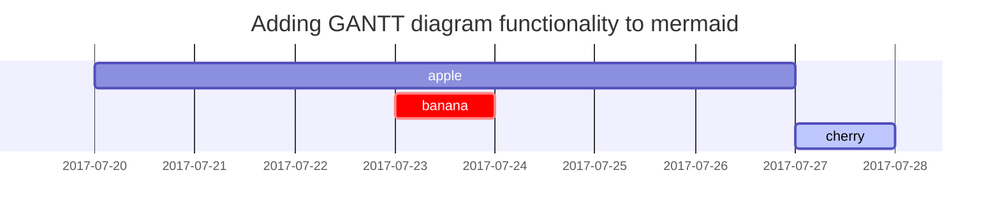

# 一级标题
## 二级标题
### 三级标题
#### 四级标题
##### 五级标题

# 分割线
-------------

普通内容

**粗体内容**

*斜体内容*

> 引用
>
> 引用
>
> > 嵌套引用
> >
> > 嵌套引用
> >
> > > 嵌套引用
> > >
> > > 嵌套引用

- 无序列表
- 无序列表
- 无序列表
- 无序列表

1. 有序列表
2. 有序列表
3. 有序列表

`行内代码`

整段代码
```html
  <div id="access-tags">
    <div class="panel-heading">热门标签</div>
    <div class="d-flex flex-wrap mt-3 mb-1 mr-3">
      <a class="post-tag" href="/tags/%E6%B5%8B%E8%AF%95/">测试</a>
    </div>
  </div>
```

```cpp
#include<iostream>
using namespace std;

int main(){
  cout << "hello world!" << endl;
  return 0;
}
```

行内数学公式

$e_{\text{man}}-e_{\text{woman}}\approx\ e_{\text{king}}- e_{?}$

${\tilde{c}}^{< t >} = tanh(W_{c}\left\lbrack a^{< t - 1>},x^{< t >} \right\rbrack +b_{c}$

整段数学公式

$$
{\tilde{c}}^{< t >} = tanh(W_{c}\left\lbrack a^{< t - 1>},x^{< t >} \right\rbrack +b_{c}
$$

$$
e_{\text{king}} - e_{\text{queen}} = \begin{bmatrix}
 - 0.95 \\
     0.93 \\
       0.70 \\
       0.02 \\
       \end{bmatrix} - \begin{bmatrix}
       0.97 \\
       0.95 \\
       0.69 \\
       0.01 \\
       \end{bmatrix} = \begin{bmatrix}
 - 1.92 \\
 - 0.02 \\
     0.01 \\
       0.01 \\
       \end{bmatrix} \approx \begin{bmatrix}
 - 2 \\
     0 \\
       0 \\
       0 \\
       \end{bmatrix}
$$

mermaid流程图




图片测试


> 信息
{: .prompt-info }

> 提示
{: .prompt-tip }

> 警告
{: .prompt-warning }

> 危险
{: .prompt-danger }

表格

| Company                      | Contact          | Country |
|:-----------------------------|:-----------------|--------:|
| Alfreds Futterkiste          | Maria Anders     | Germany |
| Island Trading               | Helen Bennett    | UK      |
| Magazzini Alimentari Riuniti | Giovanni Rovelli | Italy   |


ToDo list

- [ ] Job
  + [x] Step 1
  + [x] Step 2
  + [ ] Step 3
