# 介绍
## 算法题在公司面试比重为何逐渐提升 ？

公司业务本身的需求：

1. 数据量越来越大，用户越来越多，程序上微小的改进，能帮公司省很多资源和钱。
    
    比如谷歌高薪聘请高水平人才，但他们也只是做很简单的业务，但这对公司来讲是最省钱的。最贵的才是最省的。
    
2. 糙快猛的年代过去了，市场瓜分完毕，各公司需要守好自己的领地，在上面精耕细作，需要很好的程序设计人才。

作为选拔性考试能够选出需求的人才：

1. 有门槛，需要大量练习，是对绝对的代码能力和耐心努力的证明
2. 选出聪明的人：智力程度，学习迁移能力
3. 之前的考试内容比如框架基础知识，大家都具备了，且通过查询理解即可。所以需要新的考试来选拔人才。


## 如何高效学习算法与数据结构 ?

- chunk it up： 切碎知识点, 形成知识块和知识结构，通过结构才能进入长期记忆

- deliberate practicing：刻意练习 针对弱点痛点练习，走出切题舒适区
  - 做自己不擅长的题目
  - 一开始不熟悉的数据结构和算法练习是痛苦的，但是经过一定时间，会逐渐变为舒适区，这个时候就需要去练习新的算法了。
  
- 思考所有解法，选择复杂度最低的

- feedback 反馈及时（code review）
    - 主动型反馈：对照好的答案
    - 被动：别人给你指出问题
    - 写完后看运行时间，排位；看solution、discussion
  
- 某些固定的算法模版，需要多练习并记忆背诵（七分理解，三份记忆）
    - 很多搞竞赛的选手，心中有大量模版
    - 对常用算法模版，七分理解，三份记忆，熟能生巧
  
- 做过的题目记得复习，典型题目最少需要写5-6遍。

**常用数据结构和算法：**
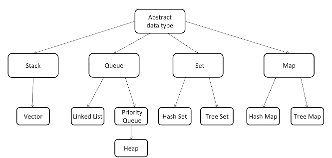

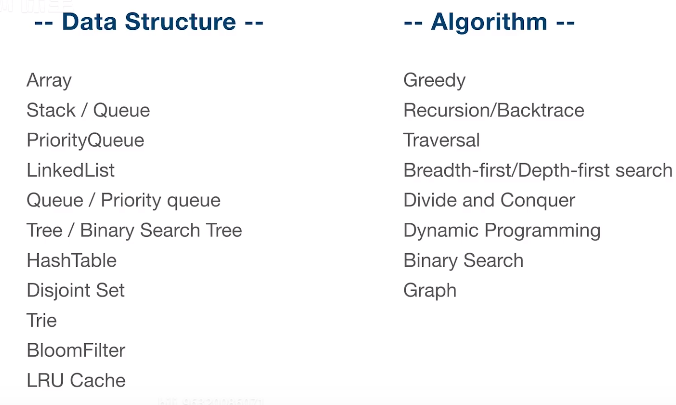


> 
> **注意：**
> 
> **三分学，七分练； 坚持刻意练习，重点在不会的题目**
>
>**想所有可能解法，选最佳的；时间空间复杂度**
>
>**算法和数据结构是内功，重在练习**
>
>**不要认为某种问题可以套用某种数据结构，不要照搬，要思考，没有一成不变的方法。**
>
>**做过的题目要返回复习，重新在写，常用模版需要熟练记忆**


### 时间复杂度 | Fibonacci Array

定义：对于输入n，程序运行次数

益处：数据越大，时间复杂度越重要，优化一点点，都能省大量时间。

#### 例子

Fibonacci array：F(n) = F(n-1) + F(n-2);  F(0) = 1, F(1) = 1 

方法一：递归，O(2^n), 问题重复计算

递归：

```python
    def fib(self, n):
        """
        :type n: int
        :rtype: int
        """
        if n == 0:
            return 0
        if n == 1:
            return 1 
        return self.fib(n-1) + self.fib(n-2)
```

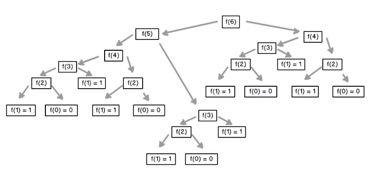

方法二：不断将前两个数累加 O(n)

```python
    def fib(self, n):
        """
        :type n: int
        :rtype: int
        """
        if n == 0 or n == 1:
            return n 
        
        p,q,r = 0,0,1
        for i in range(2,n+1):
            p, q = q, r 
            r = p + q 
        return r 
```


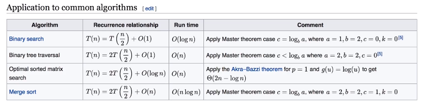

# 数据结构

数据结构与算法之间是动态平衡的关系，根据数据结构特点、需要解决的问题，进行匹配。

## Array

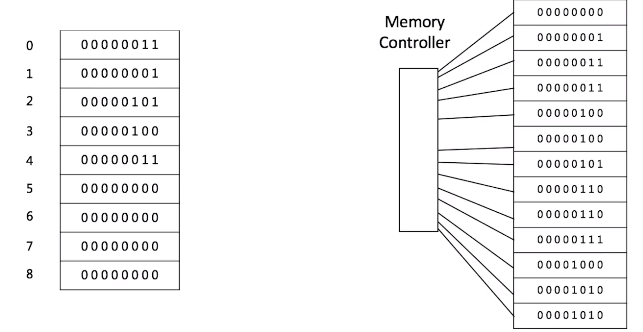

在计算机中连续存储，由内存控制器存储地址，根据地址可以获取该地址的数值。=⇒ 指定下标，就能获取数值 O(1)

获取：O(1)

增加：O(n)

删除：O(n）

（第一个元素：O(1），最后一个元素：O(n)，平均：O(n/2)，也就是 O(n)）

### 两数之和

```python
# 固定一个数，寻找另一个数，使用 dict 来存储 O(n)
def twoSum(arr, target):
    hash_map = dict()
    for i,x in enumerate(arr):
        if target - x in hash_map:
            return i, hash_map[target-x]
        hash_map[x] = i
```

## Linked List

查找：O(n)

增删：O(1)

**考察的并不是思维能力，而是实现能力，因为链表题目思维上相对直接简单**

```python
# Definition for singly-linked list.
# class ListNode(object):
#     def __init__(self, val=0, next=None):
#         self.val = val
#         self.next = next
```

### 反转链表

```python
class Solution(object):
    def reverseList(self, head):
        """
        :type head: ListNode
        :rtype: ListNode
        """ 
        node = head
        preNode = None
        while node :
            tmpNode = node.next
            node.next = preNode 
            preNode = node
            node = tmpNode 
        return preNode

# 示范代码
def reverseList(self, head):
        cur, prev = head, None
        while cur:
            cur.next, prev, cur = prev, cur,cur.next 
        return prev
```

### 24.反转链表对

以4个节点为一个单元，将其中两节点反转的过程画出来。

注意：self 的使用

```python
class Solution(object):
    def swapPairs(self, head):
        """
        :type head: ListNode
        :rtype: ListNode
        """
        prev, prev.next = self, head
        while prev.next and prev.next.next :
            a = prev.next
            b = a.next 
            prev.next, a.next, b.next,prev = b, b.next, a, a
            # prev = a 
        return self.next
```

### LinkList Cycle

解法：1. 使用set存储访问过的节点； 2. 龟兔赛跑 —— 快慢指针（终止条件：两指针相遇）

```python
class Solution(object):
    def hasCycle(self, head):
        """
        :type head: ListNode
        :rtype: bool
        """
        # visited = set()
        # node = head
        # while node:
        #     if node in visited:
        #         return True
        #     else:
        #         visited.add(node)
        #     node = node.next
        # return False 

        fast, slow = head, head
        while fast and slow and fast.next:
            fast = fast.next.next
            slow = slow.next 
            if fast == slow:
                return True
        return False
```

### LinkList Cycle II

输出环形起点位置

```python
class Solution(object):
    def detectCycle(self, head):
        """
        :type head: ListNode
        :rtype: ListNode
        """
        # visited = set()
        # node = head
        # while node:
        #     if node in visited:
        #         return node
        #     else:
        #         visited.add(node)
        #     node = node.next
        # return None 
        
        fast,slow = head, head
        while fast and fast.next:
            slow = slow.next
            fast = fast.next.next 
            if slow == fast:
                fast = head 
                while fast != slow:
                    slow = slow.next
                    fast = fast.next 
                return slow
        return None
```

#### 算法原理

l < d:

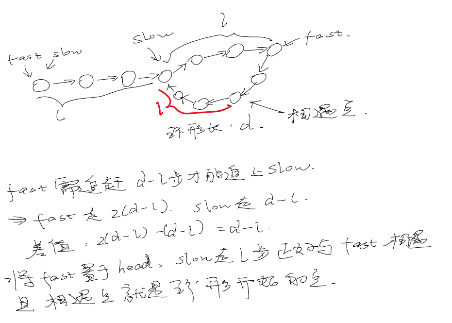

l > d:

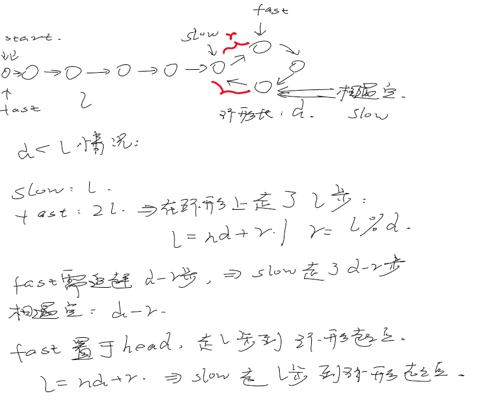

### Reverse linklist in k groups

思考过程中遇到的问题：

1. 反转后如何返回head
2. 如何将前一个group的尾结点连接到下一个group的首节点
3. 如何判断末尾是否有 k 个节点用来逆转

思维关键点：

1. group 内部就是正常的反转
2. 关键是 group 之间的关系，反转之后，group 的头尾如何跟下一个group 链接
3. **画图能更清晰看出模式**

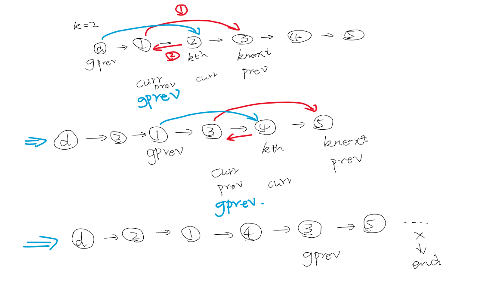

```python
# Definition for singly-linked list.
# class ListNode(object):
#     def __init__(self, val=0, next=None):
#         self.val = val
#         self.next = next
class Solution(object):
    def reverseKGroup(self, head, k):
        """
        :type head: ListNode
        :type k: int
        :rtype: ListNode
        """
        dummy = ListNode(0,head)
        gprev = dummy 

        while True:
            kth = self.getKth(gprev, k)
            if kth == None:
                break 
            gend = kth.next 
            gstart = gprev.next 
            prev = gprev.next 
            curr = prev.next
            while curr != gend: 
                curr.next, prev, curr = prev, curr, curr.next 
            gstart.next, gprev.next, gprev = curr, prev, gstart 
        return dummy.next

    def getKth(self, curr, k):
        while k > 0:
            if curr == None:
                return curr
            curr = curr.next 
            k -= 1 
        return curr 
```

#### 递归解法

下一个 group 返回的 prev 就是该group 的起点，将上一个group的终点（head）与其连接。
注意递归返回的值极其赋值

```python
def reverseKGroup(self, head, k):
        """
        :type head: ListNode
        :type k: int
        :rtype: ListNode
        """
        if head == None:
            return 
            
        curr = head 
        n = 1

        while curr.next:
            curr = curr.next 
            n += 1

        if n < k:
            return head 
        
        prev, curr = None, head 
        for _ in range(k):
            curr.next, prev, curr = prev, curr, curr.next 
        
        head.next = self.reverseKGroup(curr, k)

        return prev 

```

## Stack & Queue

FILO & FIFO

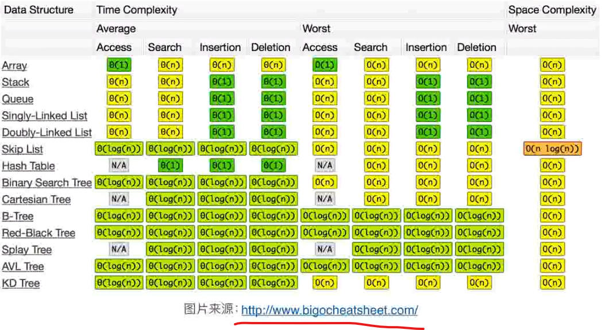

### Implement Queue using Stacks

注意事项：

1. 需要在out_stack 为空时，才执行将 in_stack 导入out_stack操作
    避免 push  push push  pop push 这样的例子
    
2. 在 pop 之前调用 peak 操作

```python
class MyQueue(object):

    def __init__(self):
        self.in_stk = list()
        self.out_stk = list()
        

    def push(self, x):
        """
        :type x: int
        :rtype: None
        """
        self.in_stk.append(x)
        

    def pop(self):
        """
        :rtype: int
        """
        self.peek()
        return self.out_stk.pop()
        

    def peek(self):
        """
        :rtype: int
        """
        if not self.out_stk:
            while self.in_stk:
                self.out_stk.append(self.in_stk.pop())
        return self.out_stk[-1]
        
        

    def empty(self):
        """
        :rtype: bool
        """
        return not self.in_stk and not self.out_stk
```

### Implement Stack using Queue

思路：新来的数放入空队列，然后将另一个队列的数放进来，能保证后来的数在队列前面。

用 deque 实现：popleft 是将queue前面的数弹出，在队列尾部增加新数之后， 使用 popleft 将前面的数弹出放入尾部，调换顺序。

用 list 实现，pop 时弹出尾部数即可。

```python
class Stack:

    def __init__(self):
        self._queue = collections.deque()

    def push(self, x):
        q = self._queue
        q.append(x)
        for _ in range(len(q) - 1):
            q.append(q.popleft())
        
    def pop(self):
        return self._queue.popleft()

    def top(self):
        return self._queue[0]
    
    def empty(self):
        return not len(self._queue)

# list 实现
class MyStack:

    def __init__(self):
        self.list = []

    def push(self, x: int) -> None:
        self.list.append(x)

    def pop(self) -> int:
        pop = self.list[-1]
        self.list = self.list[:-1]
        return pop
        
    def top(self) -> int:
        return self.list[-1]

    def empty(self) -> bool:
        return len(self.list) == 0
```

### vaild parentheses

思路：如果是左括号，入栈，如果是右括号，和栈顶元素对比，能匹配，则pop，并继续。不能则返回false。

最后检查栈是否为空，为空则返回 true。

```python
class Solution(object):
    def isValid(self, s):
        """
        :type s: str
        :rtype: bool
        """
        char_map = {')':'(', ']':'[', '}':'{'}
        deque = list()
        for x in s:
            if x not in char_map:
                deque.append(x)
            elif not deque or char_map[x] != deque.pop():
                return False
        return not deque
```

代码详解：如果不是右括号，入栈；否则如果栈空或者新元素未与栈顶元素匹配，返回false。最后根据栈是否为空返回。

### 20. 有效的括号

左括号：append

右括号：查找，匹配则pop，不匹配（或者堆栈为空）返回 false

```python
class Solution(object):
    def isValid(self, s):
        """
        :type s: str
        :rtype: bool
        """
        judgemap = {'(': ')', '{': '}', '[': ']'}
        strs = []
        for a in s:
            if len(strs) > 0 and judgemap.get(strs[-1]) == a:
                strs.pop()
            else:
                strs.append(a)

        return not strs 
        
       
    def isValid_2(self,s):
        judgemap = {')':'(', '}':'{', ']':'['}
        stack = []
        for c in s:
            if c not in judgemap:
                stack.append(c)
            elif not stack or judgemap[c] != stack.pop():
                return False 
        return not stack
```

## Priority Queue

正常顺序进入，但以优先级出。优先级是一个属性，比如按最大最小出现次数最多等方式出。
eg：在工作中，需要给事情定优先级，从事务队列中选择优先级最高的开始进行。

**实现：**
二叉搜索树，堆。（不需要手写实现，已纳入标准库）
堆：最大最小堆；有多种实现方式，其中斐波拉契及 strict fibonacci 效果最好。

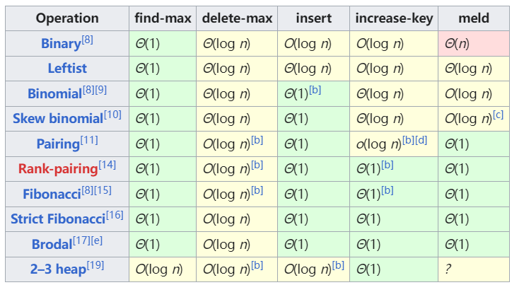

### 返回第K大的元素

将问题简化：如果是返回最大元素，记录最大元素，然后跟新元素比较，更新最大元素。

所以返回第K大元素，则记录前K大的元素。

思路：构建k个元素的最小堆，当新元素大于堆中最小元素时，弹出最小元素，将新元素加入。当新元素小于堆中的最小元素时，堆不变。最后返回堆的最小元素。

实现：

1. 优先队列（最小堆）heapq（O(logK)）
2. 每次对k个元素进行排序 （O(KlogK))
3. 相比排序，堆操作快 K 倍

```python
import heapq
class KthLargest(object):

    def __init__(self, k, nums):
        """
        :type k: int
        :type nums: List[int]
        """
        self.heap = []
        self.k = k
        for x in nums:
            self.add(x)
        

    def add(self, val):
        """
        :type val: int
        :rtype: int
        """
        if len(self.heap) < self.k:
            heapq.heappush(self.heap, val)
        elif self.heap[0] < val:
            heapq.heappop(self.heap)
            heapq.heappush(self.heap, val)
        return self.heap[0]
```

### **239. 滑动窗口最大值**

用大顶堆实现思路：
1. 将元素放入大顶堆中，当元素个数等于k时，将堆顶元素加入结果
2. 当堆顶元素的索引在滑动窗口之外时，删除堆顶元素；并不需要按照滑动窗口来删除指定元素，而是持续弹出过期的堆顶元素即可。

注意：将元素变为负数，模拟大顶堆

```python
def maxSlidingWindow(nums, k):
    max_heap = []
    result = []
    
    for i in range(len(nums)):
        # 将当前元素加入堆，注意用负值存储以模拟大顶堆
        heapq.heappush(max_heap, (-nums[i], i))
        
        # 检查堆顶元素是否过期（索引超出当前窗口范围）
        while max_heap[0][1] <= i - k:
            heapq.heappop(max_heap)
        
        # 当窗口形成时（i >= k-1），记录当前窗口最大值
        if i >= k - 1:
            result.append(-max_heap[0][0])  # 取负值恢复原值
    
    return result
```

1. 窗口中存下标
2. 将过期的下标删除
3. 保证最左边的元素是最大的，将window中小于新加入的元素的下标删除
    1. 从右边开始遍历

```python
def maxSlidingWindow(self, nums: List[int], k: int) -> List[int]:
    if not nums: return []
        window, res = [], []
    for i,x in enumerate(nums):
          if i >= k and window[0] <= i-k:
              window.pop(0)
          while window and nums[window[-1]] <= x:
              window.pop()
          window.append(i)
          if i >= k-1:
              res.append(nums[window[0]])
          # print(i, window)

     return res 
```

## Map & Set | 计数 查询

hashMap 实现原理：使用key作为hash函数的自变量，得出因变量，即是value所在的位置指针。

eg：hash函数设置为，将key的字母对应的 asics 码相加，除以30取模，得出余数，就是位置。

优点：查找时间为 O(1)，而数组为 O(n)

碰撞：使用链表，同一个位置作为链表头结点，后续接上同一位置的value。

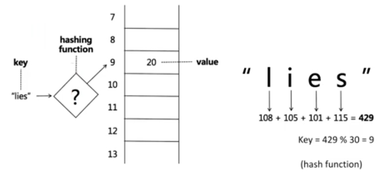{: width="600" height="500" }

Map：查询和插入都是 O(1)

list：插入：O(1)，查询：O(N)

set：插入与查询 O(1) ；【常用hashMap或者二叉树实现】

**Map 与 Set 的两种实现方式：**

|     | Hash                |                                 Tree |
| :-- | :------------------ | -----------------------------------: |
| Map | HashMap <br>查询：O(1) | TreeMap <br>有序储存 <br>查询：O(logN） <br> |
| Set | HashSet <br>查询：O(1) |      TreeSet <br>查询：O(logN） <br>有序储存 |

python dict 默认就是 hashMap，使用treeMap需要使用第三方库；hashSet 同理。

<aside>
💡

map 和 set 通常用于查询和计数;  

hashmap 查询比数组快

</aside>

### 242 Valid Anagram

```python
smap,tmap = {},{}
        for item in s:
            smap[item] = smap.get(item, 0) + 1 
        for item in t:
            tmap[item] = tmap.get(item, 0) + 1
        return smap == tmap
```

在Python中，`==` 运算符用于比较两个值是否相等。当用于比较两个字典时，`==` 运算符会检查两个字典是否包含相同的键值对。

### Two Sum（set 解法）

```python
class Solution(object):
    def twoSum(self, nums, target):
			s = set()
      for i,x in enumerate(nums):
          if target - x in s:
              return(i, nums.index(target-x))
          s.add(x)
```

## 各数据结构时间复杂度对比

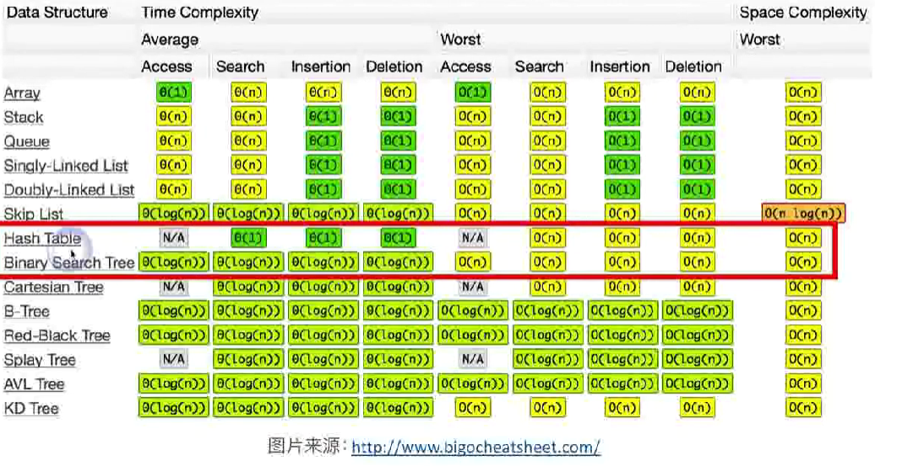

### ThreeSum

描述：找出数组中所有加和为零的三个数，不重不漏。

主要问题：返回的结果中有重复的组合

#### 方法一
解决：将输入数组排序，如果遍历的数和前一个数相同，则跳过。

思路：两个for循环，选出两个数，然后用 set 查询第三个数是否在剩余数组之中。

**关键点：判断第三个数是否在数组中时，使用 hashmap 结构，通过测试**

```python
class Solution:
    # 在判断第三个数是否在数组中时，使用 hashmap 结构，通过测试
    def threeSum(self, nums: List[int]) -> List[List[int]]:
        res = []
        nums.sort()
        ms = {}
        for i,x in enumerate(nums):
            ms[x] = i

        for i in range(len(nums)):
            if nums[i] > 0:
                break
            if nums[i] == nums[i-1] and i != 0:
                continue
                
            for j in range(i+1, len(nums)):
                if nums[j] >  -(nums[i] + nums[j]):
                    break
                if nums[j] == nums[j-1] and j != i+1:
                    continue
                if -(nums[i] + nums[j]) in ms and ms[-(nums[i] + nums[j])] > j:
                    res.append([nums[i],nums[j],-(nums[i] + nums[j])])

        return res
```

时间复杂度：O(N * N），空间复杂度：O(N)，使用了额外的set。

#### 方法二

排序，选出一个数 x 之后，使用两个指针指向剩余数组的头尾，如果两指针的数加和大于 x，右指针向右移动，如图：

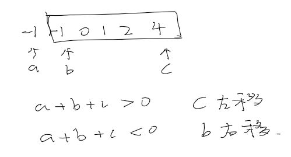

```python
    def threeSum(self, nums: List[int]) -> List[List[int]]:

        res = []
        nums.sort()

        for i in range(len(nums) - 2):
            if nums[i] == nums[i - 1] and i != 0:
                continue
            j, k = i + 1, len(nums) - 1
            while j < k:
                s = nums[j] + nums[k] + nums[i]
                if s < 0:
                    j += 1
                elif s > 0:
                    k -= 1
                else:
                    res.append([nums[i], nums[j], nums[k]])
                    while j < k and nums[j] == nums[j + 1]:
                        j += 1
                    while j < k and nums[k] == nums[k - 1]:
                        k -= 1
                    j += 1
                    k -= 1
```

注意：
1. 当左指针大于右指针时停止遍历，避免重复；
2. 当三数之和为0时，判断左右指针与相邻元素是否相等，相等则跳过，避免重复。

时间复杂度：O(n), 空间复杂度：O(1)

### 4Sum

```python
class Solution(object):
    def fourSum(self, nums, target):
        """
        :type nums: List[int]
        :type target: int
        :rtype: List[List[int]]
        """
        nums.sort()
        res = set()
        for i, x in enumerate(nums[:-3]):
            if i > 0 and x == nums[i-1]:
                continue
            for j, y in enumerate(nums[i+1:]):
                if j > 0 and y == nums[i+j-1]:
                    continue
                d = set()
                for k, m in enumerate(**nums[i+1:][j+1:]**):
                    if target-x-y-m in d:
                        res.add((x,y,m, target-x-y-m))
                    else:
                        d.add(m)
        return map(list,res)
```

注意：第三次循环的数组截取，以及判断前一个元素是否和当前元素相等时的坐标。

使用时看做三个不同数组。

## Tree | Binary Tree | Binary Search Tree

树的来源：链表，往回链接到前面的节点

图：树的孩子节点链接回父母节点

树是特殊的链表，图是特殊的树。

平时很少直接使用二叉树，为了便于查找，构建二叉搜索树，即左子节点全部小于根节点，右子节点全部大于根节点，同时左子树，右子树也都是二叉搜索树（也叫二叉排序树）。

查询，插入，删除 平均情况都是 O(logN），最坏情况：O(N）只有一边的孩子节点，退化成链表。

解决最坏情况：平衡二叉搜索树（eg  红黑树等），将链顺序打乱，然后构建更平衡的二叉树，实现复杂，较少使用。

在c++ 和 java 中的二叉搜索树都是用红黑树来实现的。

### Validate Binary Search Tree

#### 方法一：中序遍历

如果是二叉搜索树, **按中序遍历，是递增的顺序**,  按中序遍历，判断顺序

```python
# Definition for a binary tree node.
# class TreeNode(object):
#     def __init__(self, val=0, left=None, right=None):
#         self.val = val
#         self.left = left
#         self.right = right

class Solution(object):
    def isValidBST(self, root):
        """
        :type root: TreeNode
        :rtype: bool
        """
        inOrder = self.inOrder(root)
        return inOrder == list(sorted(set(inOrder)))

    def inOrder(self, root):
        if root == None:
            return []
        return self.inOrder(root.left) + [root.val] + self.inOrder(root.right)
```

缺点：list(sorted(set(inOrder))) 耗费时间和空间

**改进版：**

依旧是中序遍历，但只保留上一次遍历的值，跟当前值比较。

```python
class Solution2:

    def isValidBST(self, root: Optional[TreeNode]) -> bool:
        self.prev = None
        return self.inOrder(root)

    def inOrder(self, root: Optional[TreeNode]) -> bool:
        if root == None:
            return True
        if not self.inOrder(root.left):
            return False
        if self.prev and self.prev.val >= root.val:
            return False

        self.prev = root
        return self.inOrder(root.right)
```

#### 方法二：递归

对于左子树，最大值是

```python
class Solution:
    def isValidBST(self, root: Optional[TreeNode]) -> bool:
        """
        :type root: TreeNode
        :rtype: bool
        """
        def check(root, min, max):
            if root == None:
                return True
            if root.val >= max or root.val <= min: return False
            return check(root.left, min, root.val) and check(root.right, root.val, max)
        
        return check(root, -inf, inf)
```


每次比较的是跟节点与最大最小值，而最大最小值来源是上一层根节点的val，那如何保证相差多层之间的大小关系 ？
比如：3,4,8,7（左子树按中序遍历）

### 最近公共祖先

#### 普通二叉树

思路：如果跟节点等于p或q，返回跟节点，否则对左右子树进行搜索，如果左子树没找到，返回右子树，如果右子树没找到，返回左子树；如果在左右子树都找到了，说明根节点就是最近公共祖先。

```python
class Solution:
    def lowestCommonAncestor(self, root: 'TreeNode', p: 'TreeNode', q: 'TreeNode') -> 'TreeNode':
        if root == None:
            return None  
        if root == p or root == q: return root 
        left = self.lowestCommonAncestor(root.left, p, q)
        right = self.lowestCommonAncestor(root.right, p, q)
        if left == None: return right 
        if right == None: return left 
        return root 
```

#### 二叉搜索树

思路：利用二叉树性质，只在一个子树进行搜索，如果根节点不比 p 和 q 大或小，说明root就是分叉的节点，也就是最近公共祖先。

```python
class Solution:
    def lowestCommonAncestor(self, root: 'TreeNode', p: 'TreeNode', q: 'TreeNode') -> 'TreeNode':
        if root.val > p.val and root.val > q.val:
            return self.lowestCommonAncestor(root.left, p, q)
        if root.val < p.val and root.val < q.val:
            return self.lowestCommonAncestor(root.right, p, q)
        return root 
        
        
     # 非递归写法
     def lowestCommonAncestor(self, root: 'TreeNode', p: 'TreeNode', q: 'TreeNode') -> 'TreeNode':
        while root:
	        if root.val > p.val and root.val > q.val:
	            root = root.left 
	        elif root.val < p.val and root.val < q.val:
	            root = root.right 
	        else:
	            return root 
```


## 字典树| Trie | 单词查找树| 键树

搜索时自动匹配出后续字符，如何根据频次给出匹配字符问题，常用数据结构就是字典树。

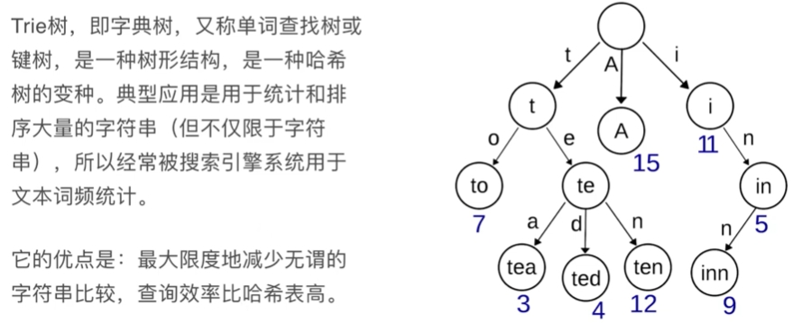

### 208. 实现字典树

```python
class Trie:

    def __init__(self):
        self.children = []
        # self.isend = False 
        # self.root = None 
        

    def insert(self, word: str) -> None:
        self.children.append(word)
        

    def search(self, word: str) -> bool:
        for s in self.children:
            if s == word:
                return True 
        return False 
        

    def startsWith(self, prefix: str) -> bool:
        cnt = len(prefix)
        for s in self.children:
            if prefix == s[:cnt]:
                return True 
        return False
```

```python
# 字典方式实现
class Trie:

    def __init__(self):
       self.root = {}
       self.end_word = '#'
        

    def insert(self, word: str) -> None:
        node = self.root
        for char in word:
            node = node.setdefault(char, {})
        node[self.end_word] = self.end_word
        

    def search(self, word: str) -> bool:
        node = self.root 
        for char in word:
            if char not in node:
                return False 
            node = node[char]
        return self.end_word in node 
        
        

    def startsWith(self, prefix: str) -> bool:
        node = self.root 
        for char in prefix:
            if char not in node:
                return False 
            node = node[char]
        return True 
        
```

```python
# node 方式
class TrieNode:
    def __init__(self):
        # 子节点，用字典表示，键为字符，值为 TrieNode 对象
        self.children = {}
        # 是否为单词的结束节点
        self.is_end = False

class Trie:
    def __init__(self):
        # Trie 树的根节点
        self.root = TrieNode()

    def insert(self, word: str) -> None:
        """插入一个单词到 Trie 中"""
        node = self.root
        for char in word:
            # 如果当前字符不存在于子节点中，创建一个新节点
            if char not in node.children:
                node.children[char] = TrieNode()
            # 移动到下一个节点
            node = node.children[char]
        # 标记当前节点为单词的结束
        node.is_end = True

    def search(self, word: str) -> bool:
        """查找单词是否存在于 Trie 中"""
        node = self._find_node(word)
        return node is not None and node.is_end

    def starts_with(self, prefix: str) -> bool:
        """查找是否存在以 prefix 为前缀的单词"""
        return self._find_node(prefix) is not None

    def _find_node(self, prefix: str) -> TrieNode:
        """辅助函数：根据前缀找到对应的节点"""
        node = self.root
        for char in prefix:
            if char not in node.children:
                return None
            node = node.children[char]
        return node
```

### **优势与局限**

1. **优势**：
    - 直接使用字典实现，无需单独定义 `TrieNode` 类，简洁直观。
2. **局限**：
    - 字典存储字符键和值可能会占用较多内存，尤其是当 Trie 树很大时。
    - 不如使用自定义节点对象灵活（例如可以添加更多属性）。

### 示例

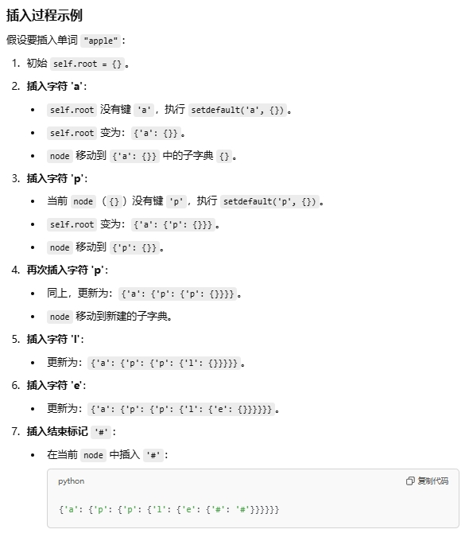

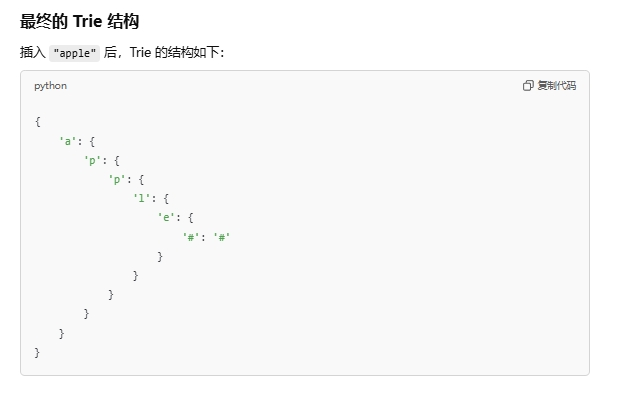

node.setdefault(char, {}) 返回的是node的引用（类似于c++指针概念），所以后续修改node，会作用于root。

### 212. 单词搜索

思路：对单词构建字典树，然后遍历表格，在表格中搜索是否有符合字典树中的单词。

理解：把图画出来，按代码逻辑走一遍

```python
class Solution:
    def findWords(self, board: List[List[str]], words: List[str]) -> List[str]:
        self.res = set()
        self.end_word = '#'
        self.dx = [-1,1,0,0]
        self.dy = [0,0,-1,1]

        root = {}
        for w in words:
            node = root 
            for char in w:
                node = node.setdefault(char, {})
            node[self.end_word] = self.end_word

        for i in range(len(board)):
            for j in range(len(board[0])):
                if board[i][j] in root:
                    self.search(board, i, j, '', root)
        
        return list(self.res)

    def search(self, board, i, j, cur_str, cur_dict):
        cur_str += board[i][j]
        cur_dict = cur_dict[board[i][j]]

        if self.end_word in cur_dict:
            self.res.add(cur_str)
        
        tmp, board[i][j] = board[i][j], '@'
        for k in range(4):
            m, n = i + self.dx[k], j + self.dy[k]
            if 0 <= m < len(board) and 0 <= n < len(board[0]) and board[m][n] in cur_dict and board[m][n] != '@':
                self.search(board, m, n, cur_str, cur_dict)
        board[i][j] = tmp 
```

## 位运算

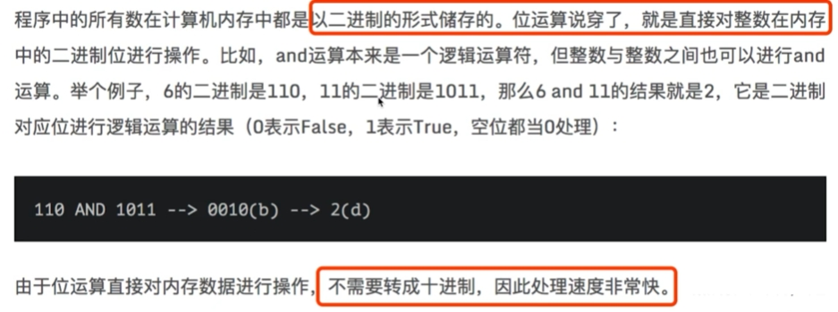{: width="600" height="400" }

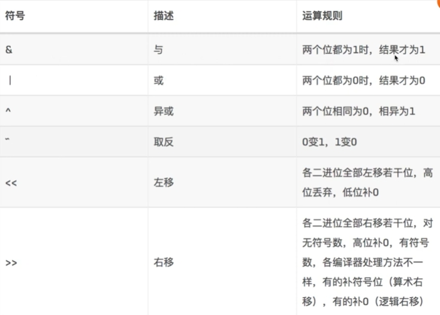{: width="600" height="600" }

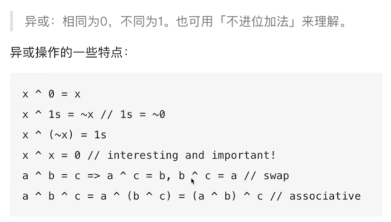{: width="600" height="500" }

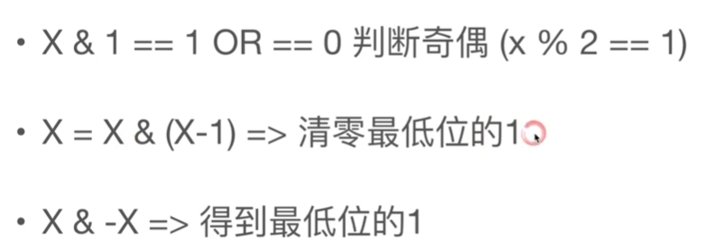{: width="600" height="500" }

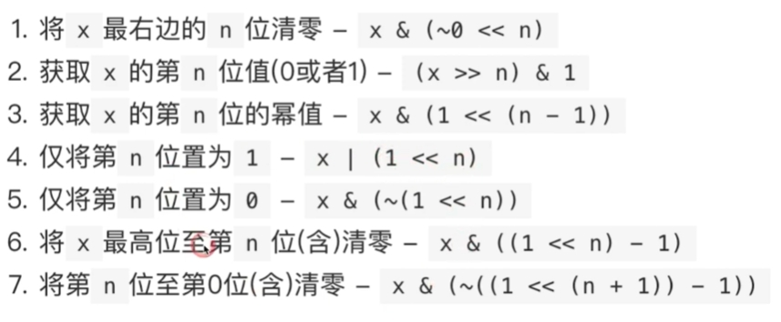{: width="600" height="500" }

<aside>
💡
n & (n-1)  消掉最低位的1.

</aside>

> 
> Leetcode 相关题目：191,231,338 

### **231. 2 的幂**

```python
    def isPowerOfTwo(self, n: int) -> bool:
        if n <= 0: return False  
        return n & (n-1) == 0
```

```python
    def isPowerOfTwo(self, n: int) -> bool:
		    if n <= 0: return False  
        if n == 1: return True 
        while abs(n) > 2:
            if n % 2 != 0:
                return False 
            n = n / 2 
        return True 
```

# 算法

## Sort

### 堆排序

思考过程：首先将数组映射成树结构

- 构建最大堆：从根节点开始，找出两个子节点中更大的节点，将其与根节点交换。将新的孩子节点作为根节点递归该过程。直到叶子节点。
- 从树结构高于叶子节点的层级开始，依次构建最大堆。
- 将根节点与末尾叶节点交换，重新构建最大堆，再次交换，递归。

实现关键点：

for 循环是逆序从大到小，从后往前遍历数组，构建最大堆以及交换最大值。

```python
def heapSort(num):

    def shiftDown(start, end):
        root = start
        while True:
            child = root * 2 + 1  # root start from zero
            if child > end:
                break
            if child < end and num[child] < num[child+1]: # find the max child
                child = child + 1
            if num[root] < num[child]:
                num[root], num[child] = num[child], num[root]
                root = child
            else:
                break

    for start in range((len(num)-1)//2,-1,-1):
        shiftDown(start, len(num)-1)

    for end in range(len(num)-1, 0, -1):
        num[0],num[end] = num[end], num[0]
        shiftDown(0,end-1)

    return num
```

### 冒泡|选择|快排|插入

```python
def exchange(a,b):
    c = a
    a = b
    b = c
    return a,b

def bubbleSort(num):
    for i in range(len(num)):
        for j in range(0,len(num)-1-i):
            print(num[j],num[j+1])
            if num[j] > num[j+1]:
                num[j],num[j+1] = exchange(num[j],num[j+1])
    return num

def selectSort(num):
    for i in range(len(num)):
        m = num[i]
        for j in range(i,len(num)):
            if num[j] < m:
                num[j],m = m, num[j]
        num[i] = m
    return num

def quickSort(num,beg,end):
    flag = num[end-1]
    i = beg -1
    for j in range(beg, end-1):
        if num[j] < flag:
            i+=1
            num[j], num[i] = exchange(num[j], num[i])
    num[end - 1], num[i + 1] = exchange(num[end-1],num[i+1])
    mid = i+1
    print(num,"str",beg,mid,end)
    if mid == beg or mid == end :
        return
    quickSort(num,beg,mid)
    quickSort(num,mid+1, end)
    return num

def insertSort(num):
    for i in range(1,len(num)):
        unsort = num[i]
        j = i - 1
        while j >= 0 and num[j] > unsort:
            num[j+1] = num[j]
            j -= 1
        num[j+1] = unsort
    return num
```

### 归并排序

二元归并：将数组不断拆分成两部分，直到数组元素只有一个，然后开始归并，归并时使用两个指针指向左右数组，将更小的数放到归并后的数组中，指针前进，直到某个数组指针移动到最后一位。

拆分时使用递归，拆成一个数之后，合并，在继续合并。

```python
def mergeSort(num):
    if len(num) <= 1:
        return num
    mid = int(len(num) / 2)
    left = mergeSort(num[:mid])
    right = mergeSort(num[mid:])
    return merge(left,right)

def merge(left,right):
    arr = []
    i,j = 0,0
    while i < len(left) and j < len(right):
        if left[i] > right[j]:
            arr.append(right[j])
            j += 1
        else:
            arr.append(left[i])
            i+=1
        if j == len(right):
            for k in left[i:]:
                arr.append(k)
        if i == len(left):
            for k in right[j:]:
                arr.append(k)
    return arr
```


## 递归&分冶

分冶：分为互不相关的子问题，能够使用并行计算

### 50. Power(x,n)

负数的小数次方无法计算，所以需要判断奇偶，单独处理奇数的情况。

```python
class Solution:
    def myPow(self, x: float, n: int) -> float:
        if n <= 2:
            return x ** n
        if n % 2 :
            return self.myPow(x, (n-1)/2) ** 2 * x
        return self.myPow(x, n/2) ** 2 
```

## 贪心算法

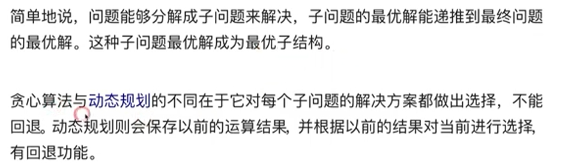

- 贪心算法只考虑眼前最优解，是目光短浅吗？（取决于怎么定义最优？）

### **122. 买卖股票的最佳时机 II**

思路：


```python
class Solution:
    def maxProfit(self, prices: List[int]) -> int:
        maxp = 0
        for i in range(len(prices)-1):
            maxp += max(0, prices[i+1]-prices[i]) 
        return maxp  
```

## 宽度优先搜索

算法起源：在树（图/集合）中查找某个特定元素，存储的元素可以表示现实生活中的任一事物。

```python
 def BFS(graph,start, node):
        queue = []
        queue.append(start)
        visited = []

        while queue:
            node = queue.pop()
            visited.append(node)

            process(node)
            nodes = generated_related_node(node)
            queue.push(nodes)   
```

无递归写法

## 深度优先搜索

计算机原生的结构使用栈，递归时也是用栈。（写法见下题）

## **102. 二叉树的层序遍历**

思路一：使用双端队列，分层遍历，level_size 控行

（如果结构是图，需要用visited 标识）

```python
# Definition for a binary tree node.
# class TreeNode:
#     def __init__(self, val=0, left=None, right=None):
#         self.val = val
#         self.left = left
#         self.right = right

class Solution:
    def levelOrder(self, root: Optional[TreeNode]) -> List[List[int]]:
        if not root: return []

        queue = **collections.deque()**
        res = []
        queue.append(root)

        while queue:
            level_size = len(queue)
            current_level = []

            for _ in range(level_size):
                node = queue.popleft()
                if node.left: queue.append(node.left)
                if node.right: queue.append(node.right)
                current_level.append(node.val)
            
            res.append(current_level)

        return res 
```

思路二：dfs，res做全局变量，每调用一次dfs，层级加深一层，将上一层的层级传入作为参数

```python
class Solution_dfs_100:
    def levelOrder(self, root: Optional[TreeNode]) -> List[List[int]]:
        if not root: return []
        self.res = []
        self.dfs(root, 0)

        return self.res 

    def dfs(self, root: Optional[TreeNode], level):
        if not root: return None
        if len(self.res) < level + 1:
            self.res.append([])
        self.res[level].append(root.val)
        self.dfs(root.left, level+1)
        self.dfs(root.right, level+1)
```

### **111. 二叉树的最小深度**| 略


### **104. 二叉树的最大深度** | 略

## 剪枝

### 22. 括号生成

递归条件判断：**右括号小于左括号数量时，才能增加右括号。**

```python
class Solution:
    def generateParenthesis(self, n: int) -> List[str]:
        self.list = []
        self.gen(0,0,n,"")
        return self.list 

    def gen(self,left, right, n, res):
        if left == n and right == n:
            self.list.append(res)
            return 
        if left < n:
            self.gen(left+1, right, n, res+'(')
        if right < left and right < n:
            self.gen(left, right+1, n, res+')')
```

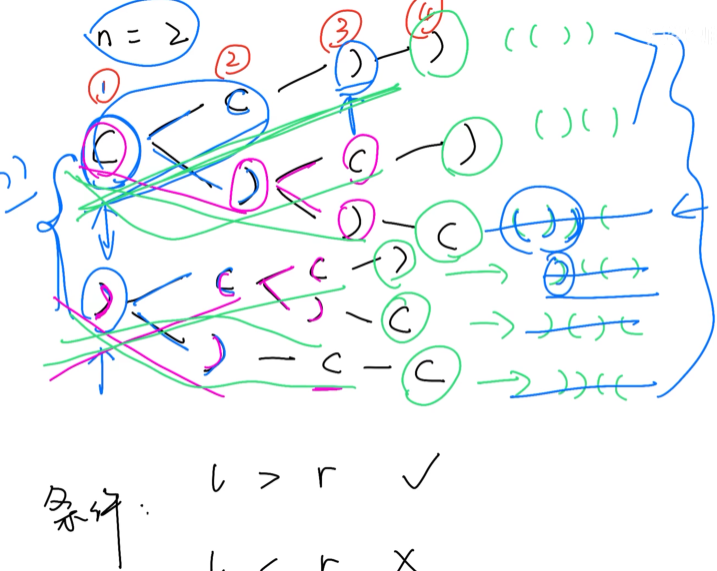{: width="400" height="400" }

### *51.N皇后问题

```python
class Solution:
    def solveNQueens(self, n: int) -> List[List[str]]:
        if n < 1: return []
        self.col, self.pie, self.na = set(), set(), set()
        self.res = []
        self.DFS(0, n, [])
        return [['.' * i + 'Q' + (n-i-1)*'.' for i in col] for col in self.res]

    
    def DFS(self, row, n, cur_state):
        if row >= n:
            self.res.append(cur_state)
            return 
        
        for col in range(n):
            if col in self.col or col+row in self.na or row-col in self.pie:
                continue 

            self.col.add(col)
            self.pie.add(row-col)
            self.na.add(row+col)

            self.DFS(row+1,n,cur_state+[col])

            self.col.remove(col)
            self.pie.remove(row-col)
            self.na.remove(row+col)
```

### *36. 数独问题  | 超出时间限制

```python
# 超出时间限制
class Solution:
    def solveSudoku(self, board: List[List[str]]) -> None:
        """
        Do not return anything, modify board in-place instead.
        """
        self.solver(board)

    
    def solver(self, board:List[List[str]]) -> bool:
        for i in range(9):
            for j in range(9):
                if board[i][j] != '.':
                    continue
                # if board[i][j] == '.':
                for k in range(1,10):
                    if self.checkValid(board, i, j, str(k)):
                        board[i][j] = str(k) 
                        print(board)
                        if self.solver(board):
                            return True 
                        board[i][j] = '.'
                return False 
        return True     

    def checkValid(self, board, row, col, c):
        for i in range(9):
            if board[i][col] == c: return False 
            if board[row][i] == c: return False 
            if board[3*(row//3) + i//3][3*(col//3)+ i%3] == c: return False 
        return True 
```

## 二分查找

排好序的数组才适用

```python
class Solution:
    def search(self, nums: List[int], target: int) -> int:
        if not nums:return -1 
        l, r = 0, len(nums)-1 
        while l <= r:
            mid = int((l+r)/2)
            print(mid)
            if target == nums[mid]:
                return mid 
            if target < nums[mid]:
                r = mid - 1
            if target > nums[mid]:
                l = mid + 1
        return -1 
```

### 69.sqrt()

```python
#返回整数
def mySqrt(self, x: int) -> int:
        if x == 0: return 0 
        if x < 4: return 1 
        l, r = 0, x/2 
        while l <= r:
            mid = int((l + r) / 2)
            if mid * mid <= x < (mid+1) * (mid+1):
                return mid
            if mid * mid > x:
                r = mid - 1
            else:
                l = mid + 1
```

```python
# 返回浮点数
def mySqrt(x: int):
    if x == 0 or x == 1: return x
    l, r = 0, x
    while l <= r:
        mid = (l + r) / 2
        print(mid, abs(x - (mid * mid)))
        if abs(x - (mid * mid)) < 1e-5:
            return mid
        if mid * mid > x:
            r = mid
        else:
            l = mid

print(mySqrt(2))
```

## 动态规划| Daynamic Programming（动态递推）

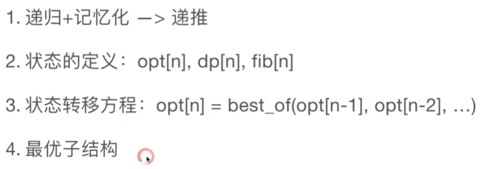{: width="600" height="500" }

#### 例子 | 斐波拉契数列

用动态规划来解斐波拉契数列（**转移方程比较简单**）

1. 将之前的结果存储
2. 从前往后算
    
    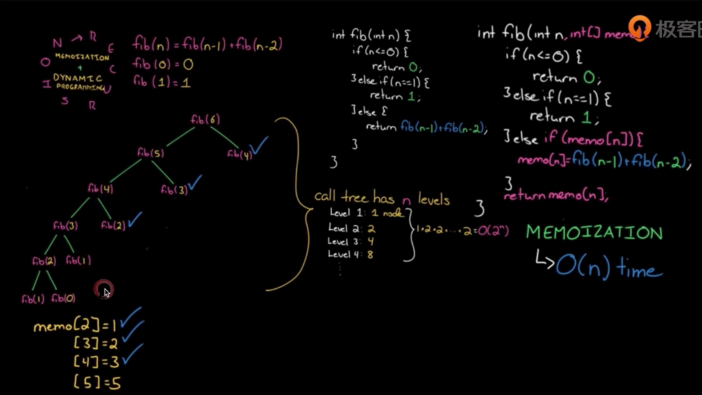{.w-75 .normal}
    

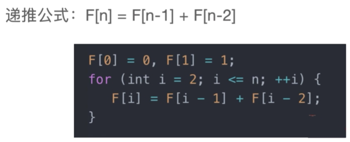{: width="500" height="300" .w-75 .normal}

#### 例子 | 最短路径

问题：从起点到终点最小步数，只能向上下左右移动。
思路：能够到达终点的是右边和下边的格子，拆解为 min(down，right) + 1, 而后续每个格子都能如此拆解。为了避免重复计算，从终点开始推起，写出终点附近每个格子的最小步数，依次递推。

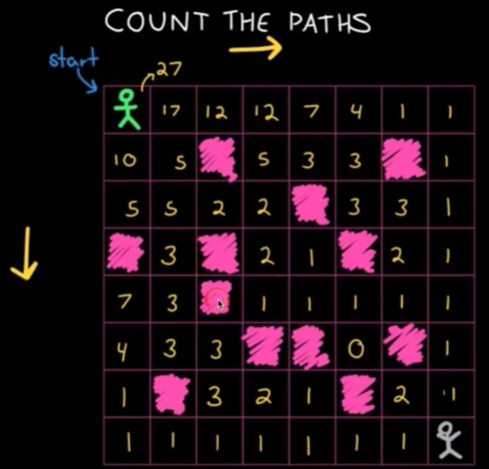


- 当回溯避免重复计算,贪心不知考虑眼前利益时，结合起来就是动态规划
- 记录最优子结构，全盘规划，能获得最优解。

### 120. 三角形最小路径和

自底向上，不断选最小值累加，res 代表计算到的当前行的累积最小值。

```python
class Solution:
    def minimumTotal(self, triangle: List[List[int]]) -> int:
        if not triangle: return 0
        res = triangle[-1]
        for i in range(len(triangle)-2, -1, -1):
            for j in range(len(triangle[i])):
                res[j] = min(res[j], res[j+1]) + triangle[i][j]
        return res[0]
```

递归解法：

```python
class Solution:
    def minimumTotal(self, triangle: List[List[int]]) -> int:
        if not triangle: return 0
        def dfs(i, j):
            if i == len(triangle) - 1:
                return triangle[i][j]
            return min(dfs(i+1, j), dfs(i+1, j+1)) +  triangle[i][j]
        return dfs(0,0)
```

### 120.  最小乘积

```python
class Solution:
    def maxProduct(self, nums: List[int]) -> int:
        if not nums: return 0
        res_max = [0] * len(nums)
        res_min = [0] * len(nums)
        res_max[0], res_min[0] = num[0], num[0]
        for i in range(1, len(nums)):
            res_max[i] = max(res_max[i-1] * nums[i], nums[i], res_min[i-1] * nums[i])
            res_min[i] = min(res_max[i-1] * nums[i], nums[i], res_min[i-1] * nums[i])
        return max(max(res_min), max(res_max))
    
```

> 股票相关题目：121、122、123、309、188、714

### 121. 股票买卖 1次

```python
class Solution:
    def maxProfit(self, prices: List[int]) -> int:
        min_price = int(1e9)
        max_profit = 0 
        for price in prices:
            max_profit = max((price - min_price), max_profit)
            min_price = min(min_price, price)
        return max_profit
```

用DP思路解决这一系列问题

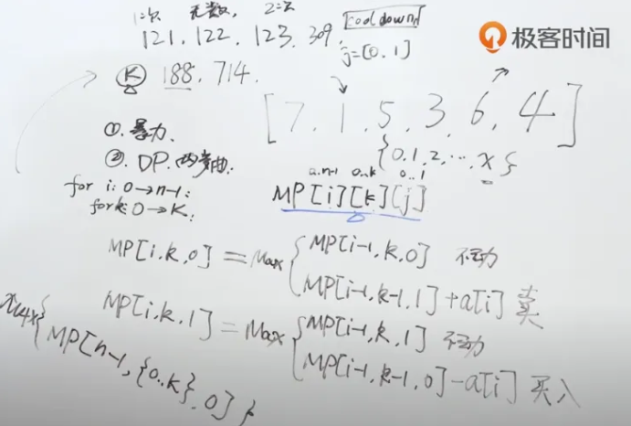

### 123 股票交易两次

```python
class Solution:
    def maxProfit(self, prices: List[int]) -> int:
        n = len(prices)
        buy1 = [0 for _ in range(n)]
        buy2 = [0 for _ in range(n)]
        sell1 = [0 for _ in range(n)]
        sell2 = [0 for _ in range(n)]

        buy1[0] = buy2[0] = -prices[0]
        sell1[0] = sell2[0] = 0

        for i in range(1,n):
            buy1[i] = max(buy1[i-1], - prices[i])
            sell1[i] = max(sell1[i-1], buy1[i-1] + prices[i])
            buy2[i] = max(buy2[i-1], sell1[i-1]-prices[i])
            sell2[i] = max(sell2[i-1], buy2[i-1]+prices[i])
        res = sell2[n-1]
        return res 
```

### 188. 股票交易 K次

```python
class Solution:
    def maxProfit(self, k: int, prices: List[int]) -> int:
        if not prices: return 0 
        n = len(prices)
        k = min(k, n // 2)
        buy = [[0] * (k+1) for _ in range(n)]
        sell = [[0] * (k+1) for _ in range(n)]

        buy[0][0], sell[0][0] = -prices[0], 0 
        for i in range(1, k+1):
            buy[0][i] = sell[0][i] = float("-inf")

        for i in range(1, n):
            buy[i][0] = max(buy[i-1][0], - prices[i])
            for j in range(1, k+1):
                buy[i][j] = max(buy[i-1][j], sell[i-1][j] - prices[i])
                sell[i][j] = max(sell[i-1][j], buy[i-1][j-1] + prices[i])
        print(buy)
        print(sell)
        return max(sell[n-1])
```


>
>例子：price = [3,2,6,5,0,3]， k=2
> 
>计算过程：
> 
>buy：[[-3, -inf, -inf], [-2, -inf, -inf], [-2, -7, -inf], [-2, -1, -inf], [0, 4, -2], [0, 4, -2]]
>
>sell： [[0, -inf, -inf], [0, -1, -inf], [0, 4, -inf], [0, 4, -2], [0, 4, -1], [0, 4, 7]]
>
>**列出DP数组能便于理解。**


### 322.  **零钱兑换**

```python
class Solution:
    def coinChange(self, coins: List[int], amount: int) -> int:
        dp = [float('inf')] * (amount + 1)
        dp[0] = 0
    
        for num in range(1, amount+1):
            for coin in coins:
                if coin > num:
                    continue 
                dp[num] = min(dp[num-coin]+1, dp[num])
        
        return dp[amount] if dp[amount] != float('inf') else -1
```

### 72. 编辑距离

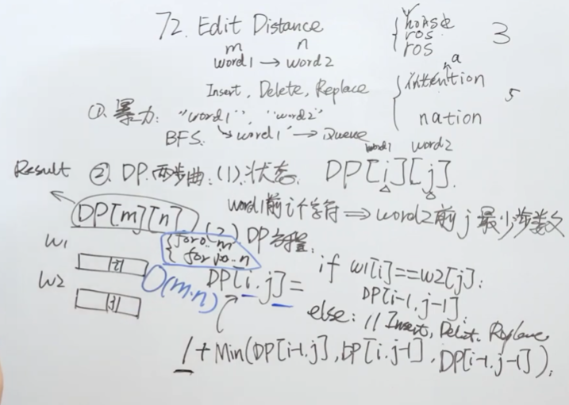

```python
class Solution:
    def minDistance(self, word1: str, word2: str) -> int:
        m, n = len(word1), len(word2)
        dp = [[0 for _ in range(m+1)] for _ in range(n+1)]
        
        for i in range(m+1): dp[0][i] = i 
        for j in range(n+1): dp[j][0] = j

        for i in range(1,n+1):
            for j in range(1,m+1):
                if word1[j-1] == word2[i-1]:
                    dp[i][j] = min(dp[i-1][j]+1, dp[i][j-1]+1, dp[i-1][j-1])
                else:
                    dp[i][j] = min(dp[i-1][j], dp[i][j-1], dp[i-1][j-1]) +1
        
        return dp[n][m]
```


>  
{: .prompt-tip }
{**总结：**
	1. 找到最优子结构
	2. 状态定义，画出dp表格，得到状态转移方程
	3. 找到初始化方式
} 

## 并查集| union & find 

在分布式系统、比特币网络及google 的mapreduce中经常使用。

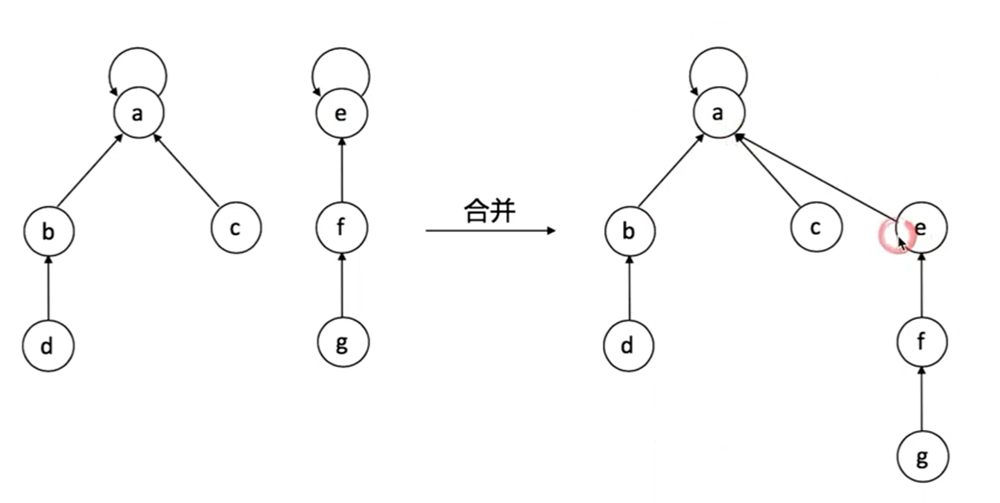{: width="500" height="300" .w-75 .normal}
合并优化方式：
1. 深度(rank) 越低，子节点查找parent 就越快，所以合并时会将较低深度的集合合并到较深的集合，避免深度的增加。
	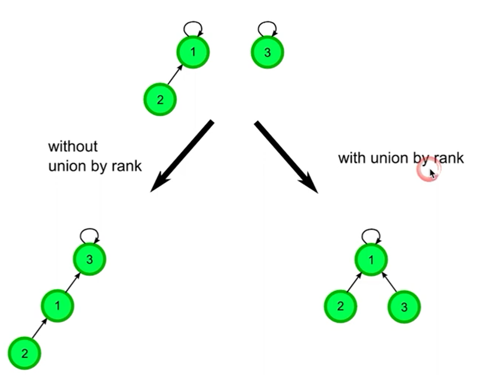{: width="500" height="300" .w-75 .normal}

2. 路径压缩
	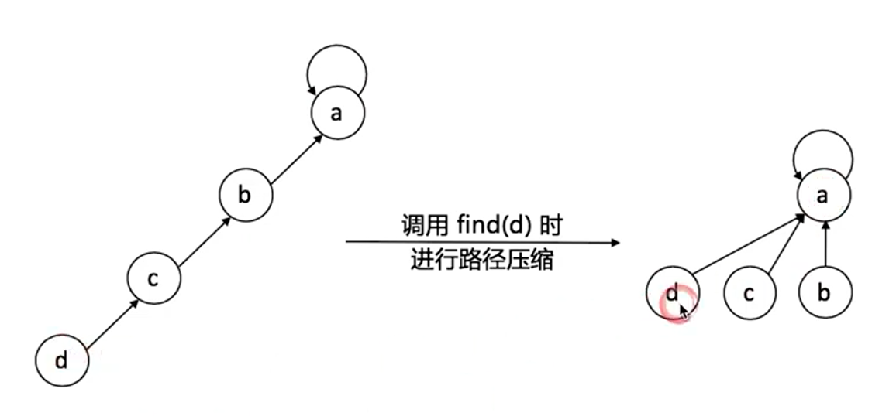{: width="500" height="300" .w-75 .normal}


### 实现 | TODO

### 200. 岛屿数量

#### 思路一：DFS
深度优先搜索次数即为岛屿数量，每次遍历后将1修改为0，避免重复计数

``` python 
class Solution:
    def dfs(self, grid:List[List[str]], row, col) -> list[list[str]]:
        grid[row][col] = 0 
        m = len(grid)
        n = len(grid[0])

        for x, y in [(row-1, col), (row+1, col), (row, col-1), (row, col+1)]:
            if 0 <= x < m and 0 <= y < n and grid[x][y] == '1':
                self.dfs(grid, x, y)
        
    
    def numIslands(self, grid:List[List[str]]) -> int:
        m = len(grid)
        n = len(grid[0])
        cnt = 0

        for i in range(m):
            for j in range(n):
                if grid[i][j] == '1':
                    self.dfs(grid, i, j)
                    cnt += 1 
        
        return cnt 
```

#### 思路二：并查集 | TODO
用并查集的方式实现？

## LRU Cache | Least Recently Used

**缓存结构：**

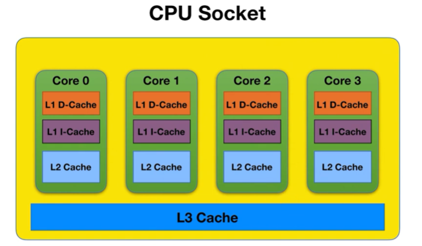


LRU：缓存替换算法，通常使用双向链表来实现，查询修改更新：O(1) 【cache 一般只查询第一个元素】

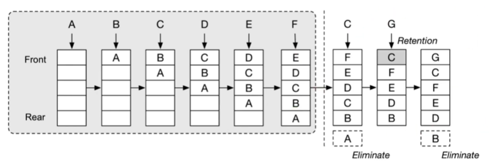

### LFU | Least Frequently Used 

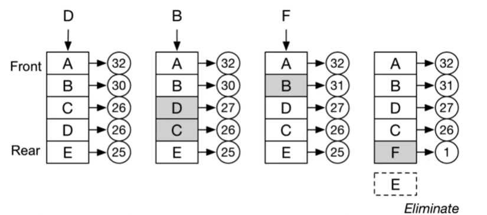

#### 146. LRU 缓存实现 | TODO


## 布隆过滤器  | Bloom Filter 

在网络中使用很多，比如高并发系统，分布式系统，比特币网络等。
和哈希映射类似，布隆过滤器将元素通过映射函数映射到二进制向量，比如一个integer就是32位二进制向量。相比其他算法，布隆过滤器的空间和时间效率都非常高，但缺点在于会有一定的查询错误率和删除困难，这里的错误率是指查询结果为在向量中，当元素不在向量中时，是能够完全正确的判断的，这也是会使用该算法的场景。
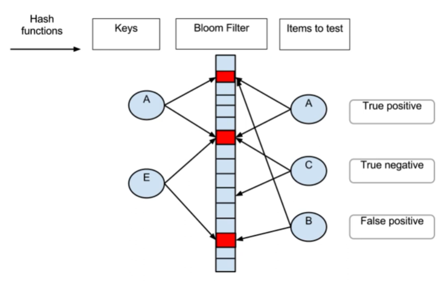
可以理解为，将不存在的元素过滤到，但后面需要跟一个完备的数据存储系统，查询到存在的元素还需要再数据系统中验证。

在比特币系统中，在客户端查询交易记录时，由于区块的数量过多，现在已经有几十万个区块了，每个区块里又有大量数据，所以在每个区块前加 bloom filter，只有在确定交易记录存在这个区块时，才会到该区块查询。在分布式系统中，验证子任务是否存在某台机器上，也使用了 bloom filter。类似需要排除大量数据的场景都可以使用 bloom filter。


## 五个代码模版

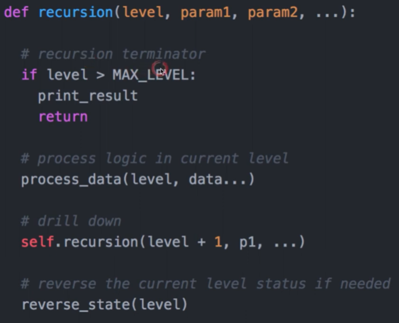{: width="500" height="500" .w-75 .normal}

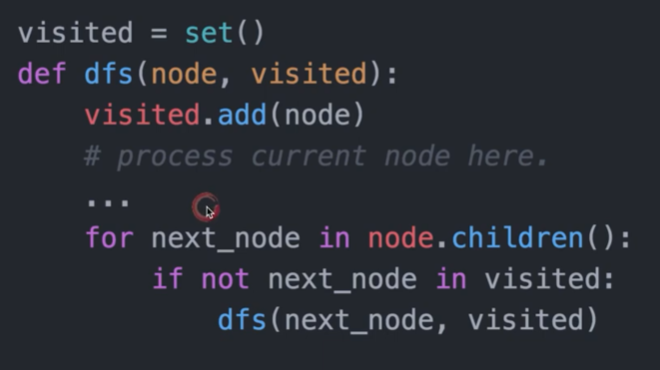{: width="500" height="500" .w-75 .normal}

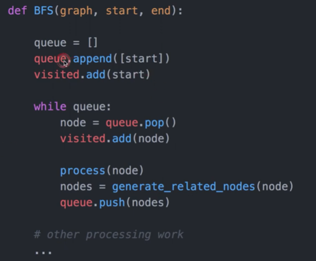{: width="500" height="500" .w-75 .normal}


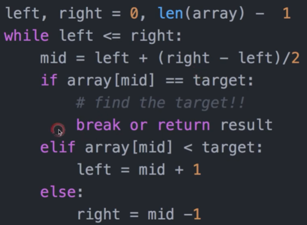{: width="500" height="500" .w-75 .normal}


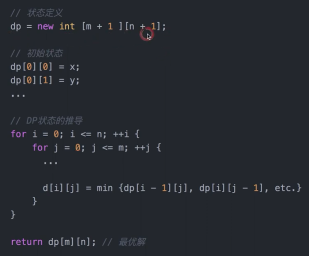{: width="500" height="500" .w-75 .normal}


# python 常用函数

### 数据结构操作

```python
字典:
hash_map = dict()
hash_map["kk"] = a 
print(hash_map["kk"])
初始化: tinydict = {'a': 1, 'b': 2, 'b': '3'}

集合:
s = set()
s.add("aa")
s.remove("aa")
s.clear()
len(s)
if "aa" in s:

字符串:
删除:
s = s[:i] + s[i+1:]
```

### 进制转换

10进制转16进制：hex()

16进制转 10 进制：int(x, 16)

2进制转 10进制：int(x, 2)

2进制转 16进制：hex(int(x,2)) 

10进制转 2进制：bin()

转为 8 进制：oct()


---

**Reference**

-  面试通关40讲
    - [https://www.bilibili.com/cheese/play/ep31711?csource=Hp_searchresult&spm_id_from=333.337.0.0](https://www.bilibili.com/cheese/play/ep31711?csource=Hp_searchresult&spm_id_from=333.337.0.0)
    - [https://www.youtube.com/watch?v=BJFy5vQw9Eo&list=PLn5XLkWHBxytAK44RlzKmZcM-PDylOa-z&index=53](https://www.youtube.com/watch?v=BJFy5vQw9Eo&list=PLn5XLkWHBxytAK44RlzKmZcM-PDylOa-z&index=53)
- 《剑指offer》
- Leetcode 相关题目题解
