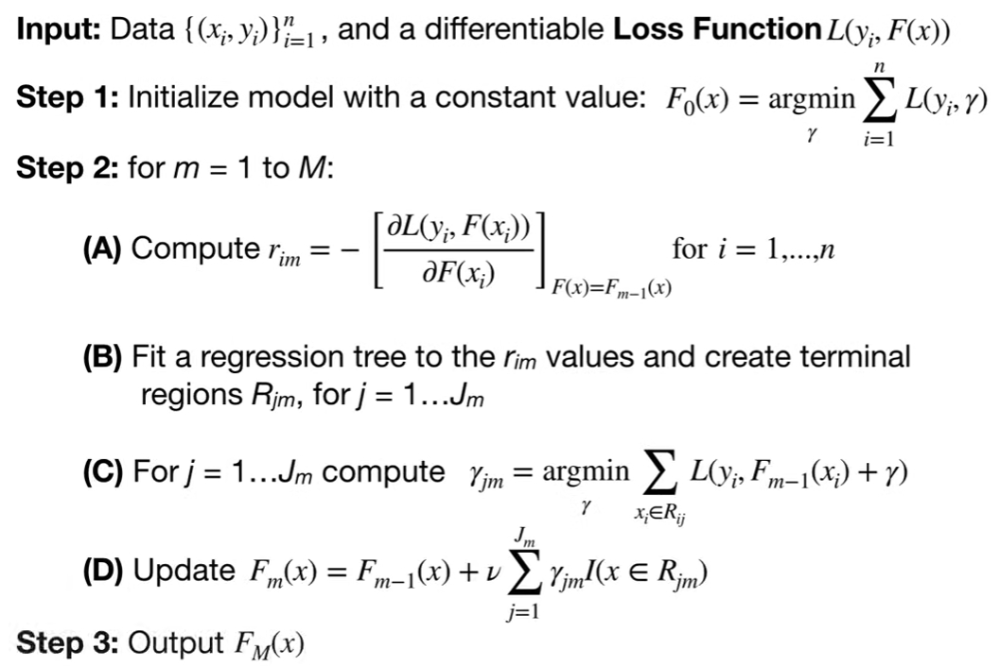

决策树相关算法从 1980 年代到 2010 年代经历了从单棵树到集成学习、再到工业化优化的漫长发展过程。CART 是集成学习的核心基础，而 GBDT 系列（包括 XGBoost 和 LightGBM）进一步优化了树的训练方式和效率，成为机器学习领域的重要基石。本文根据决策树相关算法发展历程，介绍从单棵决策树到XGBoost算法演变过程。

# 决策树

决策树是一种可以对数据进行分类和预测的算法，是一种树状的模型。其中每个节点表示特征，自上而下，每个样本根据对不同特征的取值，落到不同的叶子节点，表示类别或数值。可以看做if else的划分结构。当决策树用于分类时，叫做分类树，用于预测具体数值时，叫做回归树。

决策树算法主要是在20世纪八九十年代，那时候是人工智能发展的早期阶段，主要是以专家系统、专家规则来完成目标任务，但手工构建规则耗时耗力，在这个背景下，研究者们提出了决策树模型，用决策树模型自动生成判断规则，引入信息论中熵的概念，形成ID3算法，在这个基础上，改进后提出C4.5算法，为了将分类和回归问题统一处理，提出CART算法，为了解决过拟合问题，发明剪枝技术。

决策树的相对其他算法一个明显的优点是可解释性，根据树的结构，能够获取特征划分及权重，能够知道每个样本是如何从根节点划分到叶子节点的。在银行及保险行业，可解释性是很重要的，有时还需要将理由展示给客户，所以决策树相关算法在这些行业也有广泛应用。

但缺点在于稳定性，数据中掺杂一点噪音，比如某个样本的某个特征有偏移，最终结果可能就是错误的，这一点可以用集成学习解决。第二个缺点是容易过拟合，当数据很复杂时，可以生成很宽很深的树，极端情况就是每个样本分到不同叶子节点，这样无法拟合未见过的数据，解决方法是剪枝，降低树的复杂度。以及由于树是顺序结构，在计算过程中不太容易并行，不太容易利用GPU及cpu的并行性。这些问题都会在有决策树延伸而来的其他算法中得到解决或缓解。

## 如何构建一个决策树？

其中关键问题是树的每个节点选择哪个特征，以及对于有多个取值的特征，如何选择划分点。构建决策树时，需要考虑样本落入叶子节点之后的准确度和树模型的性能，能够越快越准的得出分类或预测值。

选择不同特征作为划分节点，以及节点之间的顺序，都会影响最终叶子节点的划分结果，进而影响模型精度。

接下来通过一个简单的例子说明这一点。

![[Pasted_image_20241222192423.webp]](../assets/img/posts/2025-01-11-从决策树到XGBoost/Pasted_image_20241222192423.webp){: width="600" height="500" }

对于上图的数据，列出决策树的两种构造方式

方式 1：首先按“年龄段”划分

1. 根节点：按`年龄段`分裂。
    - 青年：多数不购买。
    - 中年：多数购买。
    - 老年：结果混合，需要进一步分裂。
2. 次节点：对“老年”组按`收入水平`划分。
    - 收入高：不购买。
    - 收入中/低：购买。

此时，决策树很好地分离了数据，预测准确率较高（准确率为 87.5%，即 7/8 个样本正确分类）。

方式 2：首先按“收入水平”划分

1. 根节点：按`收入水平`分裂。
    - 收入高：结果混合（有买有不买），需要进一步分裂。
    - 收入中：购买。
    - 收入低：购买。
2. 次节点：对“收入高”组按`年龄段`划分。
    - 青年：不购买。
    - 中年：购买。
    - 老年：不购买。

由于“收入水平”并不是一个良好的初始分裂特征，树的分类能力较弱，可能会导致部分数据误分类（准确率为 75%，即 6/8 个样本正确分类）。

上述例子中，根据观察样本，能够发现年龄与是否购买的关系更强，先将年龄作为划分特征，能够更快更准的得出结果，这是因为相比收入，年龄这个特征能够更多的减少信息不确定性，所以需要的划分次数会更少，同时相关性更强，划分后的子集样本纯度更高，所以也会更准确。

如何度量选择不同特征划分后纯度的差异？这里介绍两种常用的方式。

## 如何选择划分节点？

### 分类任务

#### 信息熵| 信息增益 | ID3

熵最早是物理学里的概念，表示系统的混乱程度，比如气体、液体、固体的熵递减，而系统总会朝着熵增的方向运动，熵增同时也是能量在退化，不能做功的能量总数在减少。

信息论中，熵这个概念是香农从热力学领域引入的概念，用来度量信息的不确定性，也就是信息带来的惊讶程度，当一个事件发生概率越高，真正发生时引起惊讶程度也越低，反之，惊讶程度越高，比如太阳从东边升起，人不会觉得惊讶，因为这是概率极高极确定的事件，而当晴天突然下雨，人们就会感到惊讶，因为这很少发生概率极低。这种惊讶程度可以描述为不确定性，跟概率成反比（表示为 1/P）。
只用 1/P 来定义不确定性的问题在于，当 p = 1 时，不确定性应该为0， 为此，对 1/P 取对数 log(1/P)，同时取对数也有将乘法变为加法的作用。

随机变量的信息熵定义为所有事件的惊讶值(不确定性)的期望：

{: width="400" height="300" }

信息熵越大，说明该样本空间的不确定性越高，纯度越低，反之，纯度越高。

##### 例子 (猜对字母所需的最小问题数量)

如图，有三个字母序列，对比序列的熵，直觉上我们就能知道最下面的熵最高，最混乱，不确定性越最高，通过计算也能知道熵值和直觉相符。

{: width="300" height="300" }

假设A从序列中随机抽取一个字母，B需要猜测A抽取的字母，B知道是从哪个序列抽取的字母，B可以提问，而A只能回答是或否，对于不同序列，B需要提几个问题才能够猜对？

序列一不需要问题，下图是序列二、三需要问题的问题，可以看出，进行多次这样的游戏，对每个序列，B 平均需要提问的最少次数就是熵的数值。

{: width="600" height="400" }

{: width="600" height="400" }

{: width="600" height="400" }

序列二构建了两个决策树，第二个决策树选择问题时优先排除概率更大的字母，所以所需问题更少，也就是分支更少，这两种构建方式也体现着用信息熵的方式来构建决策树。

如果在构建新分支时，选择的特征能够最大限度的增加子集的纯度，能够优先排除概率更大的子集，划分后的子集能够更容易被确定，也就是信息熵越低，那么决策树将会是最少分支的结构，如何度量选择不同特征时，信息熵的变化呢？

信息增益正是用来度量用某个特征对集合进行划分后，信息熵的变化：

{: width="500" height="400" }

如图，特征a相对数据集D的信息增益为，划分前D的信息熵减去划分后的子集加权信息熵，计算信息熵时使用的第k类样本的概率为数据集中第k类样本占总样本的比例。信息增益表示使用特征a后，熵减的程度。分类，是从无序到有序，追求熵减，所以熵减的程度越多，说明该特征的分类效果越好。

在决策树ID3算法中，使用信息增益作为划分标准，选择增益最大的特征作为当前划分点，对生成的子集做同样操作，直到所有子节点都只有一个类别，完成分类。

#### 信息增益率 | C4.5

上述划分方式的问题在于，偏好分支多的属性比如ID，电话号码之类属性，不确定性减少很多，信息增益大；但无泛化能力，不可用。

这就引出增益率的概念：

{: width="400" height="300" }

IV(a) 称为划分熵（split entropy），度量特征a 划分后的子集数量，子集数量越多越均匀，熵越大，IV(a) 越大，反之，IV(a) 越小。

信息增益衡量划分后熵的减少程度，IV(a) 衡量分支数，作为分母起到规范化的作用。增益率同时考虑这两个因素，表示在二者之间的权衡。信息增益越大越好，划分熵越小越好，好的取值可能有多个，哪一个是最佳的呢？通常无法判断，在具体使用时，为了避免IV(a) 极小的情况，选出信息增益并不大的属性，通常采用启发式方法，从候选划分特征中选出信息增益较高的，然后从中选择增益率最高的。

信息增益率在C4.5算法中使用。

<aside>
💡

划分算法对结果的影响
根据相关研究和实验，不同评估指标对结果影响差异并不明显，产生的决策树其实是类似的。剪枝对泛化性能影响更大，带来的提升也会更大。

</aside>

#### 基尼指数| Gini impurity

基尼指数也称为基尼不纯度，用来度量集合中样本纯度。假设集合G有J个类别，从中随机抽取一个样本进行随机类别标记，该样本归属于 i 类的概率为 pi，则分类错误的概率为 1- pi，考虑所有类别得出集合G的分类错误概率：

这个公式也可以用于描述集合G的纯度，如果集合G中的样本集中于某个类别，纯度高，分类错误率低，基尼指数也低，样本分布越均匀，纯度就越低，分类错误率和基尼不纯度也就越高。

也可以如下图直观的理解，矩阵的横纵坐标表示集合中的元素，矩阵中每个元素表示随机从集合中抽取的两个元素，基尼不纯度的计算也就是全集减去所有拿到相同元素的情况，也就是 1 减去所有元素概率的平方和。

{: width="600" height="400" }

既然基尼不纯度能够度量集合的纯度，那就能够用来在构建决策树时进行特征选择，计算每个特征作为节点后划分的子集的基尼不纯度之和，选择使基尼不纯度最低的特征最为当前节点，依次对每个子集进行相同的操作，进而得出完整的决策树。详细计算和生成过程在各类书籍和资料中都有具体例子，这里就不赘述了。

用基尼不纯度生成分类决策树的算法称为 CART（classification and regression tree），CART 中的回归树用平方误差最小来生成。基尼不纯度无法用于回归任务是因为基尼不纯度本身就是基于类别分布来定义的，无法度量连续特征的纯度，而回归任务的目标也不是分类纯度，而是减少误差。

> 经济学中的基尼指数
基尼指数是科拉多·基尼提出用于度量各个国家收入不平等程度的，如图，横坐标表示从低到高按收入排序的人数，纵坐标表示累积收入，如果一个国家收入完全平等，那人数的增加和累积收入的增加是完全同步的，可以用图中的45度曲线表示，但实际情况并非如此，通常较低收入人数增加时，累积收入增加缓慢，而到较高收入人群一端时，累积收入增加迅速，实际情况称为洛伦兹曲线。之所以称为洛伦兹曲线，是因为基尼指数是基尼在[马克斯·洛伦兹](https://en.wikipedia.org/wiki/Max_O._Lorenz)的研究基础上提出的。
45度曲线和洛伦兹曲线之间的面积称为基尼指数，数值越小，收入越平等，反之，收入差距越大。

{: width="400" height="400" }

### 回归任务

为什么需要回归树来进行预测，是因为某些样本无法用线性函数拟合，回归树能够更好的处理这类数据，如下图的示例，线性预测是很糟糕的，但右边的回归树能将数据划分成四类，和数据分布更加一致。

{: width="600" height="400" }

{: width="600" height="400" }

回归树构建思路和分类树是类似的，只是在选择划分特征时，使用均方误差指标。对每个特征，将每两个相邻值的平均值作为候选分裂点，使用该分裂点生成的子集，子集的预测值为子集中所有样本标签的均值，计算预测值与子集每个样本实际值的均方误差和，选择误差最小的作为该特征的分裂点。对其他特征进行同样计算，最后选择误差最小的特征及其分裂点作为当前划分节点。然后对划分后生成的每个子集做同样查找，直到生成的子集中样本数或子集的均方误差和小于某个设定的阈值，停止划分。

## 处理过拟合 | 剪枝

决策树的一个缺点是容易过拟合，当数据很复杂时，可以生成很宽很深的树，极端情况就是每个样本分到不同叶子节点，这样无法拟合未见过的数据，解决方法是剪枝，降低树的复杂度。

有以下剪枝方法：

1. 预剪枝：在生成决策树的过程中，用验证集对每个划分节点计算划分前后的评估指标（分类准确率或者均方误差），如果评估指标没有增加，则减掉这次划分。
    
    缺点：是贪心思路的做法，问题在于某些划分在当前是没有增益的，但加上后续划分后，可能效果会加强，预剪枝没有考虑到后续划分的影响。
    
    优点：节约训练时间。
    
2. 后剪枝：生成完整决策树之后，考察每次划分对精度是否有提高，如果没有提高则减去此次划分。对比剪枝前后的效果时，剪枝后的计算是将各分支的样本合并到父节点，选取类别数最多的样本类别作为父节点的标记。
    
    后剪枝的泛化性能优于预剪枝，但花费的时间更多。
    

**评估指标中增加复杂度惩罚项**

在计算划分前后的评估指标时，可以加上复杂度惩罚项，公式如下：

{: width="200" height="150" }

这里的C(T)代表当前树的评估指标，可以是准确率或均方误差，T 表示树的复杂度，可以用层级来计算，alpha 为自定义参数。这个公式是对评估指标和树复杂度的权衡，同时考虑了训练集下最佳精度和对新数据的泛化性。

可以用交叉验证的方式来选择alpha，给定候选alpha 值，得出不同交叉训练集和验证集下的多个最佳 C_alpha(T)，对这些 alpha 求均值作为选定 alpha，然后将在该 alpha 下的最佳决策树作为最终决策树。

处理过拟合，除了剪枝，还发展出其他方法，比如后续介绍的集成学习（Ensemble Learning）。

## 连续值

连续值有多种处理方法：

1. 对连续特征的值进行排序，将每两个相邻值的平均值作为候选分裂点，用评估指标评估不同划分点的增益，选择最优划分点。
2. 分箱法：将连续特征分为多个区间（离散化），然后按照离散特征的方式处理。
3. 在 xgboost 和 lightGBM 等更新的方法中，使用加权的增量优化方法，并结合正则化。在使用时，连续值不需要预处理。

## 数据缺失

这是在实践中经常遇到的问题，业务数据从生产到采集经过层层处理，中间的每个环节都有可能造成数据丢失，有时候在数据源头就拿不到完整字段。如何处理缺失的字段对于算法训练也是很重要的。

比较简单粗暴的做法就是把这条数据删掉，但这么做可能会有些潜在的问题，一是减少了数据量，当特征维度很高时，绝大部分数据都会有缺失值，很难有具备完整特征的数据，直接删除数据，就不可行了。二来只选取有完整字段的数据，会影响采样的随机性，可能会造成偏差。

如果使用含缺失值的数据，存在两个问题，第一个是如何选择划分特征，其二是根据划分特征划分类别时，如果样本在该特征上缺失，如何划分？

对于第一个问题，在选择特征作为划分点，计算信息增益或基尼指数时，不带入缺失的数据，比如样本D有N个数据，但特征A只有J条数据，就只根据这J条数据来计算信息增益，计算J条数据中各类样本的比例作为概率，算出增益之后乘以该特征下的数据缺失率。

至于第二个问题，可以按权重来划分，比如特征A划分出2个子集A1和A2，子集样本数分别为N1和N2，那特征A缺失的样本按照权重 N1/(N1+N2)，N2/(N1+N2) 分布进入两个子集。这个做法将划分后的后验作为缺失值的先验，也是符合直觉的做法。这种方式的具体例子可以参见周志华老师《机器学习》决策树一章。

上述方式并不需要填充缺失值，而是计算权重来划分。也有其他填充缺失值的方式，比如用特征取值的均值或中位数来填充，或者找该特征跟其他特征的相关性，通过其他特征的取值来推测缺失值。

# 集成学习| Ensemble Learning

集成学习是用多个学习器组合来解决某个问题，所以集成学习的关键问题在于选择哪种类型的学习器来作基本单元，以及如何将单个学习器组合在一起。可以选择单一模型来生成单个学习器，这样的问题在于如何保证这些学习器的多样性，因为一种模型生成的学习器可能是同质化的，也可以选择不同类型的模型做基础学习器，这样的问题在于如何比较这些学习器的好坏以及如何组合，不同算法的输出无法直接比较，比如树模型和神经网络，在对比之前需要进行校准，实际中使用的并不多，有时会用神经网络来做特征提取，将输出前的一层喂给树模型，严格说这并不算集成学习的范畴。这里重点关注同一种算法训练的学习器实例的集成。

在追求最终效果的过程中，对上述问题的不同解法发展出不同的集成算法，主要有boosting 和 bagging 两种，两种方式的主要区别在于基学习器的生成顺序，boosting 是串行依次生成单个学习器，比如 adaboost，后面学习器依赖于前面学习器对训练样本赋予的权重。bagging 是并行生成多个学习器，比如随机森林算法。

{: width="600" height="400" }

从上图左边的例子能够看出，三个学习器准确率都不到 70%，但采用多数投票原则将学习器组合形成最终结果，准确率达到 100%。但右边的两个例子，效果却不好。这给我们直觉上的认识，单个学习器要好而不同，基于这种认识，研究者提出 error-ambiguity decomposition， E = E’ - A， 总误差等于单个学习器的平均误差减去多样性，但这两个因素大概率是互斥的，比如追求各个模型精度高，那这些模型很可能是非常相似的，这种情况下，追求多样性，势必要牺牲某些模型的精度。这个公式表现出这两个因素之间的权衡取舍。

其实机器学习很多评估指标都是多个指标复合组成的，都是在多个因素之间权衡，只能在这种权衡中逼近最优解，而无法完全达到最优解，不像一些理论那么完美，反而存在很多模糊地带，这跟现实世界很像，现实中的任务通常需要考虑众多因素，而无法评估最优解，或许就是因为现实任务复杂性和模糊性的存在，才催生出这样的机器学习算法。

## Boosting | AdaBoost（Adaptive Boosting）

Boosting 算法是从一个理论问题发展而来，1989 年，Michael Kearns 和 Leslie Valiant 在计算理论的重要会议 STOC（Symposium on Theory of Computing）中提出问题：如果一个算法可以稍微优于随机猜测（即“弱学习器”），是否可以通过某种方法将其转化为一个效果非常好的学习器（即“强学习器”）？ 这个问题提出时的背景是，弱学习好训易得，但强学习器十分困难，将弱学习器转化为强学习器是一个可能的方向，但更多被当成一个理论问题。

1990 年，Robert E. Schapire 在论文 *"The Strength of Weak Learnability"* 中首次证明：弱可学习等价于强可学习。并提出一个理论框架，将多个弱学习器通过重新分配样本权重的方式，提升为强学习器。这是第一个boosting算法，是后续算法的理论框架。

1993年，Freund 提出通过多数投票原则组合多个弱学习的机制。

1997 年，Robert E. Schapire 和 Yoav Freund 提出Adaboost，对错误分类的样本增加权重的方式训练多个弱学习器，采用加权组合的方式集成弱学习器。是第一个可以落地实现的 Boosting 算法，从adaboost 开始衍生出一系列算法，形成 boosting 算法家族。

<aside>
💡

总结来说，Boosting 的核心思想在于，根据一个分布，训练出学习器，然后调整调整分布，在重新训练学习器，将多个弱学习器的输出通过加权或投票的方式组合成最终的预测结果。

</aside>

> Probably Approximately Correct（大概正确性）
> 对于某个问题，如果存在一个算法，在多项式时间内可以以高概率找到一个接近真实目标的解，那么这个问题称为可学习的。
> 这个概念描述了机器学习任务的求解方向，并不要求最优解，只需要大多数情况下满足一定精度要求即可，就像电商业务的推荐系统，无法确定最优解，只能有一个基础解，然后在这个基础上，不断优化效果。
> {: .prompt-info }

### Adaboost 算法过程

  选定基学习器，数据集训练第一个学习器之后，用该学习器在数据集上预测，增加判断错的样本的权重，降低对的样本的权重，然后根据权重重新采样，新数据集中，错误样本会增加，用于训练第二个模型，以此类推，不断训练新模型。
  如果选用决策树模型作为基学习器，adaboost 采用树桩（stumble）作为基学习器，节点划分由之前介绍的信息熵或基尼指数等方式确定。
  将多个弱学习器的输出通过加权或投票的方式组合成最终的预测结果。训练出来的模型，后面的模型解决的是更困难的问题（前面模型没做对的），所以要赋予更多权重。
  重点在于分配权重，包括训练过程中样本权重更新，以及最终生成的学习器权重。详细过程如下：

- 最终结果由所有树桩加权投票确定

**进一步推导：**

{: width="500" height="1000" }

- 经过推导缩减后，权重更新规则为： 正确分类样本的总权重缩小为 1/2，错误分类样本的总权重增大为 1/2。使得弱分类器在后续迭代中更关注被错误分类的样本，逐步提升整体分类器的准确率。

Adaboost 算法在当时有很大影响力的原因：
1. 算法简单有效，应用广泛。
2. 发展出 boosting 算法族，其中某个算法改进，这一族的算法都能够得到改进。
3. 很好的理论保证，能够证明一定条件下，训练误差随轮次指数级下降。具体内容可以到Freund 和 Schapire 在 1997 年的论文中进一步查看。

> Boosting 不会过拟合
> 这个是实验结果，原因有一些解释，但并不确定。
> 这个问题从 1998 [Schapire, Freund, Bartlett & Lee] 提出 Margin 理论，到 2013, [Gao & Zhou] 得出真正的 Margin 分布界中间有不同的答案和修正，是一个很有趣的研究故事，也给后续机器学习算法设计一些启发，有兴趣的可以进一步看看。
{: .prompt-tip }

# GBDT

GBDT 将 Boosting 从分类问题扩展到回归任务，结合梯度提升算法，它通过逐步构建多个决策树（通常是 CART 树），以最小化目标函数（loss 函数）。

为了让每一棵树尽可能降低当前损失，GBDT 的每次迭代用一棵树来拟合负梯度，用于修正前面的模型。这样新树就能够沿着最速下降的方向调整预测值，从而有效减少损失。对于平方损失，负梯度正好等于残差；对于其他损失，负梯度近似反映了预测值与真实值的差异方向，也称为伪残差。

GBDT 通用算法过程如下：

{: width="600" height="600" }

### 回归

首先生成一个叶子节点，取值为所有数据的平均值作为所有样本的预测值，然后根据预测值和样本真实值的差（也就是残差），生成下一棵树，树的叶子节点一般在8-32的范围内，叶子节点取值为叶子节点中样本均值，也就是拟合的残差值，新的预测值为叶子节点取值加上之前的预测值，然后重新计算残差生成下一棵树，直到终止条件。 

<!--  -->

{: width="600" height="600" .w-75 .normal}

- 残差：loss函数的负梯度；loss为均方误差时，梯度为预测值与目标值的差，故称为残差。
- 初始化：初始树是一个叶子节点，节点预测值为所有样本均值
    - 该初始预测值 通过预测值与目标值均方误差最小化，也就是梯度为零 计算得出
    - GDBT中所有树的叶子节点预测值都是该叶子节点下样本均值，计算方式同上
- 单课树的生成：
    - 每次分裂节点时，选择一个特征及其对应的分割点，使得分裂后的损失最小化（残差平方和最小）。
        - 划分到分裂节点中的样本值为当前残差值
    - 树拟合的是残差，也就是将残差划分到不同叶子节点中，根据残差计算叶子节点输出值
    - 叶子节点的输出值为叶子节点中残差值的均值
    - 基于梯度下降的思想，利用损失函数的梯度信息调整预测值。
- 更新预测值
    - 在图中 step2 的D步骤，是以递归的方式计算的，考虑先前所有数的预测值
- 有了新的预测值，在重新生成新树，递归前序步骤，直到所有树生成完毕

总结：初始化预测值之后，计算残差，生成树拟合残差（最小化误差方式，生成树将每个残差落到叶子节点），计算叶子节点样本残差均值得出叶子节点输出值，更新预测值。递归该过程直到终止条件。

### 二分类

GBDT用于分类和回归的过程是类似的，区别在于 loss 函数及其梯度的计算。

#### loss 函数

#### 初始预测值

{: width="600" height="400" }

{: width="400" height="250" .w-75 .normal}

#### 残差计算（负梯度）

根据前一轮预测值，计算残差。

{: width="600" height="400" .w-75 .normal}

- 用残差生成新的树，树划分点选取规则为最小化损失函数（残差平方和），选择损失函数的减少量最大的划分点。

#### 叶子节点输出值计算

- 叶子节点表示对于观测值， 当前预测值需要调整的偏移量，向梯度方向调整。
    
    {: width="600" height="400" }
    
    {: width="600" height="800" }
    
    进一步化解：
    
    {: width="500" height="500" }
    
    {: width="600" height="200" }
    

#### 预测值

基于加法模型和前向优化，综合目前所有树对误差的拟合，计算新预测值，生成残差，生成下一棵树。递归上述过程。

#### 预测概率
多棵决策树预测值线性相加之后，通过 sigmod 函数计算。

### 多分类| 略

对于一个多分类问题，GBDT通常为每一个类别分别构建多个回归树，在预测的时候计算预测样本在多个类别上的回归累计值，然后做Softmax运算（多个类别上的指数变换求总和，然后将不同指数变换除以总和归一化到0～1），从而得到不同类别上的概率。

>💡
> 泰勒级数是一种局部逼近工具，基于函数的导数值，通过多项式的形式无限逼近函数值。
> 函数值和泰勒多项式的误差可以用 **拉格朗日余项公式** 表示。
{: .prompt-tip }

# XGBoost| extreme gradient boost

xgboost 是 gradient boost 的一种高效实现，算法设计出来后，工程实现的好坏对于算法最后的效果和性能也有非常重要的影响。GBDT 提出来后，使用的人并不多，直到陈天奇用很多工程技术将其高效实现，明显提升性能后，才被广泛使用。

### 算法原理

#### Loss 函数

{: width="600" height="600" .w-75 .normal}

#### Loss 函数泰勒近似

根据观察可以看到，在划分点和叶子节点输出时，都是最小化损失函数，所以这里的计算可以简化。xgboost 中对loss函数统一使用泰勒二阶近似：

{: width="400" height="100" }

- y^ 表示前一棵树的预测值，y表示观测值，w 表示叶子节点输出值，表示相对于当前预测值需要调整的偏移量，这样定义便于泰勒展开。
- g 表示Loss函数对上一轮预测值的一阶导数，h （Hessian）表示二阶导数，

#### 叶子节点输出值

{: width="300" height="200" }

- 这里只取跟输出值相关的项，忽略了正则项中叶子结点数（后续在求导中也会取零）

对目标函数求导取零，得到最小loss对应的输出值，作为叶子节点的输出值：

- 这里的一二阶导数，和GBDT中分类和回归中导数相同。

#### 划分点选择（相似度增益）

在划分节点时，选择能使损失函数降低最多的划分点，根据上面的推导，将定义相似度为（Lambda为正则项）：

{: width="400" height="100" }

计算增益，划分后左右子节点相似度之和减去父节点相似度，γ 作为分裂惩罚，用于防止过拟合：

{: width="600" height="100" }

在不同划分点中计算增益，选择相似度增益最大的特征及特征值作为划分点。

#### 剪枝

设定阈值，相似度增益大于该阈值才能分裂，否则剪枝。

Lambda 在计算相似度作为正则项，起到降低相似度的作用，进而降低增益，进而起到鼓励剪枝的作用。

#### 迭代过程

1. 根据Loss最小化得出初始预测值
2. 计算一阶导数和二阶导数
3. 根据相似度增益生成树，计算叶子节点输出值
4. 根据之前所有树的线性加和，得出每个样本新的预测值
5. 更新预测值，计算导数，递归迭代

在这个过程中，XGBoost 的分裂点选择考虑了一阶梯度和二阶梯度，使得分裂点更合理。同时相似度引入了对梯度和 Hessian 的更细粒度的度量，使得分裂决策能够同时考虑到一阶梯度信息（误差方向）和二阶梯度信息（误差变化率）。相比传统 GBDT，XGBoost 的相似度机制更为灵活和高效，也因此能支持更加复杂的正则化和优化。引入显示正则，增加对模型复杂度的控制。

无论是 GBDT 还是 XGBoost，叶子节点的值都是在拟合当前预测值与真实值之间的误差，通过多棵树的累加逐步逼近真实值。都是基于梯度下降的思想，利用损失函数的梯度信息调整预测值。XGBoost 算法内核其实就是GBDT，是在GBDT上增加正则和工程实现上的优化。

### 工程优化

#### 分裂点优化：

问题：在决策树构建过程中，分裂节点需要找到一个特征及其对应的阈值（分裂点），使得目标函数的增益（Gain）最大化。对于每个特征，通常需要遍历该特征的所有可能取值，计算不同分裂点的增益，这个过程计算量非常大，尤其当特征数量和样本数量很大时，效率低下。

优化思路：

1. 直方图近似算法
    1. 将每个特征的连续值划分为固定数量的区间（称为“桶”或“bin”）
    2. 对属性取值范围进行分位点划分，将分位点作为候选划分点，减少划分点选择的计算量。默认情况，大约选取33个分位点。（近似贪心） 
    3. 直方图区间相似度的计算：区间内所有样本一阶导数和的平方 / 区间内所有样本二阶导数和 
    4. 加权直方图（？）
        1. 权重：每个样本 Loss 函数的二阶导数
        2. 每个区间权重之和接近
2. 在特征维度上并行化：
    1. 每个线程负责计算一个或多个特征的最佳分裂点。
    2. 最终汇总每个线程的结果，找到全局的最佳分裂点。
3. 小数据量时使用贪心算法（遍历所有分裂点，根据增益进行划分），当数据量较大时，才会使用上述优化。

#### 缺失值

- 计算当缺失值样本分配到左子节点或右子节点时的增益。
- 根据增益的大小，选择使增益最大的方向作为缺失值样本的默认方向，后续处理样本都在该分支。
- 遇到相同特征缺失的样本需要预测时，将其划分到训练时计算的默认分支中。

优点：
- 无需额外的数据预处理： XGBoost 内置缺失值处理机制，不需要用户填补缺失值。
- 动态最优分配： 缺失值样本的分配是基于增益最大化动态确定的，而不是硬性规定到某一侧。
- 支持高效训练： 缺失值处理与树构造过程无缝集成，计算高效。

#### 数据存储

**缓存**
- 将一阶二阶梯度存在 cache 中，便于计算相似度和叶子节点，避免重复计算。
- 在节点分裂时，XGBoost 需要计算特征值的排序来确定最佳分裂点，这个操作非常耗时。XGBoost 在初始化时对所有特征进行全局排序，并缓存排序索引块结构。后续分裂只需要利用缓存的索引，无需重新排序。这个块结构也使得并行成为可能，在进行节点的分裂时，需要计算每个特征的增益，最终选增益最大的特征进行分裂，那么各个特征的增益计算就可以多线程进行。

**压缩**：

数据量很大无法全部放入cache时，对数据进行压缩放入硬盘，进行快速读取。

- 稀疏矩阵表示：XGBoost 支持稀疏数据输入（例如，缺失值或零值较多的数据），使用稀疏矩阵格式存储特征数据。这种存储方式仅记录非零值的索引和内容，极大地降低了内存使用。
- 按列存储（列块化）：数据按列存储（columnar storage），而不是传统的按行存储。因为在计算分裂点时，每次仅需对一个特征进行操作，按列存储可以显著减少对不相关特征的访问开销。
- 块压缩（Block Compression）：对连续数值特征进行压缩存储，以进一步降低内存占用。这在大规模数据场景下尤其重要。

# 总结

1. 单棵决策树（如 CART）是后续集成学习模型的基础。
    - Bagging 和 Boosting 算法（如 Random Forest 和 AdaBoost）通过组合多个决策树，提升单个模型的鲁棒性和性能。
    - GBDT、XGBoost、LightGBM 等进一步结合梯度提升和优化技术，将集成学习推向实用化。
2. 集成思想的传承：
    - Bagging 和 Boosting 是决策树的两种核心集成方式，演化出 Random Forest 和 GBDT。
    - 随后，XGBoost 等模型在此基础上对性能和效率进行了大幅优化，成为工业界的主流算法。
3. 对人工智能的影响：
    - 集成学习和决策树结合的思想（如 GBDT 和 XGBoost）广泛应用于实际业务，如推荐系统、广告排序、金融风控等。
    - 算法的不断演化不仅提升了机器学习模型的性能，也推动了分布式计算、特征工程等领域的发展。

## 时间轴：
- **ID3（1986 年）**：信息论驱动，提出信息增益，用于离散分类任务。
- **C4.5（1993 年）**：改进 ID3，引入信息增益率解决多值特征偏好问题，解决了连续特征和缺失值等问题。
- **CART（1984 年）**：从统计学的角度设计，统一支持分类与回归，提出了基尼指数和均方误差作为分裂标准。是后续集成学习算法（如 Random Forest、GBDT 等）的基础。
- **Boosting（1990年）**：Michael Kearns 和 Leslie Valiant 在理论计算机科学的背景下研究弱学习器和强学习器的关系，提出了PAC学习框架和Boosting的理论基础，为集成学习奠定了理论基础。
- **AdaBoost（1995年）**：Yoav Freund 和 Robert E. Schapire 提出了著名的AdaBoost算法，通过迭代调整样本权重，让弱学习器（如决策桩）聚焦于难分类样本。标志着集成学习的一个里程碑。
- **Bagging（1996年）**：Leo Breiman 提出了Bagging（Bootstrap Aggregating）方法，通过对同一个数据集进行有放回抽样产生多个子数据集，训练多个模型后对结果进行平均（回归）或投票（分类）。用于提高模型的稳定性和准确性。
- **Random Forest（2001年）**：Leo Breiman 提出了随机森林（Random Forest），将决策树与Bagging相结合，通过随机选择特征和样本提高模型的泛化能力。是集成学习领域的重要发展。
- **GBDT (1999年):** Jerome H. Friedman 提出了梯度提升方法（Gradient Boosting Machine, GBM）,将梯度提升算法与决策树结合，用于回归和分类任务。通过逐步拟合负梯度，减少损失函数的残差，提升模型性能。
- **XGBoost(2014年):** Tianqi Chen 提出，对 GBDT 进行工程优化。使用正则化控制模型复杂度（防止过拟合）。引入分布式计算，提高计算效率。增加对缺失值处理的自动化。
- **LightGBM (2017年)**:  在大规模数据集上效率更高。
- **CatBoost(2018年):** Yandex 提出，专注于解决分类特征和数据偏态问题。使用新的目标编码技术，避免数据泄漏。对决策树算法进行了优化，适用于非平衡数据集。

注：本文中截图都来自于网上公开视频或课程，由于个人博客只是用于知识梳理和分享，就不一一标注了，来源一并放在 reference 中。

**reference**：

- 《机器学习》 周志华
- 《统计学习方法》李航
<!-- [http://rob.schapire.net/papers/strengthofweak.pdf](http://rob.schapire.net/papers/strengthofweak.pdf) -->
- [https://medium.com/udacity/shannon-entropy-information-gain-and-picking-balls-from-buckets-5810d35d54b4](https://medium.com/udacity/shannon-entropy-information-gain-and-picking-balls-from-buckets-5810d35d54b4)

课程：

- [https://www.bilibili.com/video/BV1xm42177qY?spm_id_from=333.788.videopod.sections&vd_source=f6c8c14c628a44075bbde25615d36944](https://www.bilibili.com/video/BV1xm42177qY?spm_id_from=333.788.videopod.sections&vd_source=f6c8c14c628a44075bbde25615d36944)
- [https://www.bilibili.com/video/BV1Cs411c7Zt/?spm_id_from=333.337.search-card.all.click&vd_source=f6c8c14c628a44075bbde25615d36944](https://www.bilibili.com/video/BV1Cs411c7Zt/?spm_id_from=333.337.search-card.all.click&vd_source=f6c8c14c628a44075bbde25615d36944) 
- [https://www.bilibili.com/video/BV1dM411U7qK?spm_id_from=333.788.videopod.episodes&vd_source=f6c8c14c628a44075bbde25615d36944&p=17](https://www.bilibili.com/video/BV1dM411U7qK?spm_id_from=333.788.videopod.episodes&vd_source=f6c8c14c628a44075bbde25615d36944&p=17)
- [https://www.bilibili.com/video/BV17u411f7dt/?spm_id_from=333.337.search-card.all.click&vd_source=f6c8c14c628a44075bbde25615d36944](https://www.bilibili.com/video/BV17u411f7dt/?spm_id_from=333.337.search-card.all.click&vd_source=f6c8c14c628a44075bbde25615d36944)

概念讲解：

- [https://www.youtube.com/watch?v=YtebGVx-Fxw](https://www.youtube.com/watch?v=YtebGVx-Fxw)
- [https://www.youtube.com/watch?v=9r7FIXEAGvs](https://www.youtube.com/watch?v=9r7FIXEAGvs)
- [https://www.youtube.com/watch?v=u4IxOk2ijSs](https://www.youtube.com/watch?v=u4IxOk2ijSs) 
- [https://www.youtube.com/watch?v=g9c66TUylZ4](https://www.youtube.com/watch?v=g9c66TUylZ4)
- [https://www.youtube.com/watch?v=wPqtzj5VZus](https://www.youtube.com/watch?v=wPqtzj5VZus)
- [https://www.bilibili.com/video/BV155411W7de/?spm_id_from=333.337.search-card.all.click&vd_source=f6c8c14c628a44075bbde25615d36944](https://www.bilibili.com/video/BV155411W7de/?spm_id_from=333.337.search-card.all.click&vd_source=f6c8c14c628a44075bbde25615d36944)

