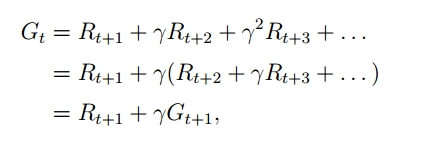
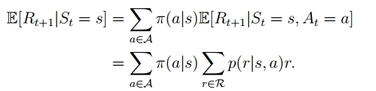
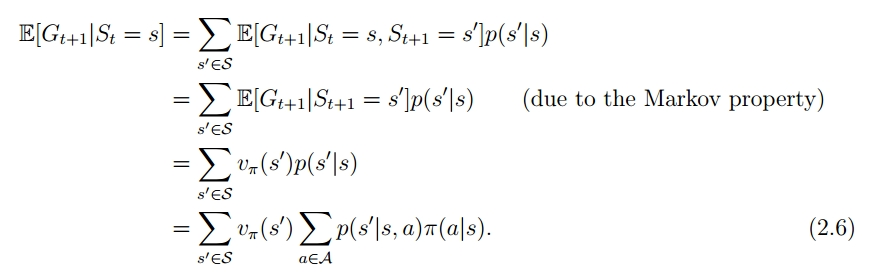
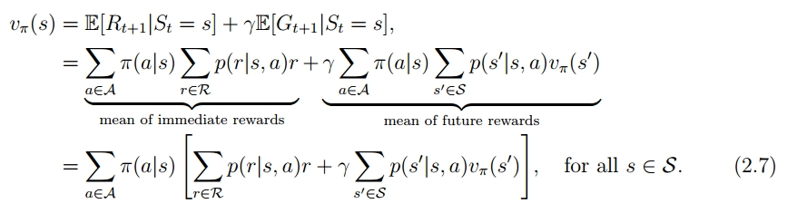
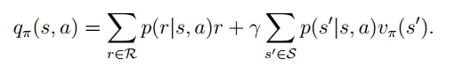

# 强化学习-笔记

本文从强化学习最基本的概念说起，梳理强化学习是怎么从最简单的q-table演变到近年来常用的ddpg、ppo等算法，描绘出各个算法之间的脉络和内在关联，展现各个算法面临的问题，以及在基础上延伸出的新算法，希望能让读者看到强化学习面临的问题，算法演进的全貌和动力。

本文避开强化学习诸多概念定义，只介绍少量必要概念，更多的集中于核心算法的演变思路。

# 强化学习基本概念|MDP

强化学习这个概念来源于行为心理学中的“效果律”（试错法），直观地看，人跟环境交互，某些行为会带来奖励，某些行为带来惩罚，人会加强带来奖励的行为，减弱带来惩罚的行为。强化学习的基本思路也是如此，根据环境的反馈，不断优化行为，使得最终的奖励最大化。

强化学习的核心问题便集中在这个模式之中，比如如何构建模拟环境，能够更真实的模拟现实环境中的状态和反馈，进而训练能够应用到现实环境中；以及如何构建奖励，如何设计动作，如何优化策略迭代训练。

举个例子，我们想训练能够进行五子棋对弈的智能体，需要将双方棋子的位置和空点相关的盘面信息抽象为状态特征，而奖励的设计可以是最终获胜为正得分，输了就为负得分，平局为零分，也可以设计一些中间奖励，比如连成双三或者死四也给正向奖励。

动作则是在棋盘空点坐标上放我方棋子。

这里边提到的状态、奖励、动作、下一个状态，被称为四元组，符号表示为（s、r、a、s‘）（state、reward、action、next_state）从起始状态开始，不断从动作集中选择动作，状态不断转移，形成一个序列或轨迹：S0,A0,R1,S1,A1,R2,S2,A2,R3….

为了从数学上对这个过程进行表述，将其抽象为马尔科夫决策过程（MDP），mdp是描述在随机环境中序列决策的数学框架。包含四元组元素和策略及状态转移，马尔科夫属性是指后续状态分布只与当前状态有关，与过去状态无关。比如棋盘游戏中，你做决策只需要知道当前状态，而并不需要知道过去每一步是怎么走过来的，也就是当前状态其实已经包含了过去所有决策的信息。

在不同状态下选择不同动作，形成不同策略，策略分为确定性策略和随机策略，确定性策略是指在某个状态下选择某个动作的概率为1，所以确定性策略下，在环境中运行多次，生产的轨迹是确定且相同的。随机策略是指在某个状态下选择动作是一个概率分布，在环境中用随机策略运行多次，会生成不同的轨迹。

强化学习的核心主题就是在这样的状态和动作定义下，如何选择动作，进而最大化期望累积回报。奖励是在单次动作的意义上，累积回报（return）也就是从开始到结束所有动作获取奖励累加，期望累积回报者是指在某个策略下，生成的多条轨迹的累积回报的均值。

在相对复杂的情况中，以一定概率选择动作之后，转移到的状态和获取的奖励都是一个概率分布，这时算期望回报，就需要将到选择动作、转移到不同状态，获取不同奖励的概率分布考虑在内。

评估一个策略的好坏的有两种方法，一种是遍历该策略生成的所有可能的轨迹路线，来计算累积回报均值，一种是根据策略的概率分布和状态转移概率、获取的奖励回报概率，来计算期望累积回报。

策略评估是从初始状态到终态的期望回报，而动作选择是在每一个状态下做出的，所以将状态的价值定义为从该状态到终态的期望回报，在选择动作时，选择能够转移到更高价值状态的确定动作或者动作概率分布即可。

为了便于记录从每个状态出发到终点的累积回报，将其定义为状态价值函数，定义为：

.png)

表示在策略π下，状态s的期望回报。这里的π为策略，也就是在状态s下选择动作a的概率。

如果能计算出所有状态的期望回报，也就是求解出状态价值函数，那么在选择做决策时，每次都选择能转移到当前能够转移到的最大价值的状态即可。

但有时选择动作后，转移到的状态是一个概率分布，而且状态价值函数没有和动作关联起来，而最终要求解的策略是关乎动作选择的。所以还需要动作价值函数，即在当前状态选择这个动作后，经过所有可能的轨迹，到终点的期望回报，定义为：

.png)

状态价值函数和动作价值函数的关系为：

-q(s).png)

策略π下，状态价值等于在该状态下，策略给出的可选动作的动作价值的加权平均。

如果已知准确的动作价值，那么每次选择最大动作价值对应的动作即可。

在这个思路下，求解最优策略问题转化为状态价值和动作价值的估计问题，如果能准确的估计每个状态和动作的价值，最优策略也就是水到渠成的事情了。

### 值函数方法|value-based

在这个问题定义的模式下， 动作选择问题就演变为状态价值函数和动作值函数求解问题，这是值函数方法的核心问题。

贝尔曼方程是求解价值函数的核心，贝尔曼方程给出了连续两个状态价值之间的关系，下面是从期望回报的定义推导出贝尔曼方程：

.png)

（将贝尔曼方程与前面描述价值函数和动作值函数关系的式子对比，能够得出：）

接下来的问题就是如何求解贝尔曼方程，首先将上面的公式进行向量化表示，转换过程如下：

可以直接对该公式求解：

但由于当状态空间较大时，对矩阵求逆的计算量会很大，所以通常使用迭代法求解：

生成{v_0、v_1、v_2.. v_k}的序列，v_0 是对v_π的初始估计，可以从数学上证明，当 k 趋于无穷大时，v_k 趋近于 v_π：

这个迭代法会在后面的 policy-iterateion 算法中用到。

贝尔曼最优公式

贝尔曼公式描绘了任一策略中相邻状态间的数学关系，直观的看，所有策略中期望回报最大的策略即为最优策略。从数学上定义最优策略：

这个定义看起来是很严苛和理性化的，那在这个定义下，是否存在最优策略，最优策略是否唯一，以及如何求解，这些问题可以通过贝尔曼最优公式来找到答案。

贝尔曼最优公式的定义：

贝尔曼最优公式的解存在且唯一，能用迭代法来找到最优解，这是通过 contraction mapping theorem 来证明的。

（）（这里有三部分需要证明：1. contraction mapping theorem 理论本身；2. 贝尔曼最优公式符合 contraction mapping 的定义；3. 用迭代法求出的解的最优性。这三部分在数学上能够证明，具体过程不在这里详述了。）

接下来的问题就是如何用迭代法求解贝尔曼最优方程，根据  contraction mapping theorem 求解的迭代算法，有两种迭代方式，一种是 value-iteration，一种是 policy-iteration

value-iteration

迭代公式为：这里有两个互相依赖的优化问题，首先是根据v_k找到

迭代过程为，求解给定 v_k 下的满足右边等式的策略 π，然后根据策略 π，求解 v_{k+1}，在根据同样的过程，不断迭代 v_k+2、v_k+3…，当 k 趋向于无穷大时，v_k 和 π 逼近最优解。

给定v_k，求解π的过程为policy update：

展开：

这里用贪心算法更新策略，π是一个概率分布，对每个状态s，将使q_{k}(s,a)最大的动作的概率设为1，就能保证上述式子最大化。

然后用更新后的策略来更新 v_{k}，得到 v_{k+1}：

也就是说：

算法流程图：

也就是，根据当前的v_k，算出 q(s,a)，然后根据 q(s,a) 用贪心算法更新策略，然后用更新后的策略来更新 v_k。由于策略的更新方式是贪心算法，所以 v_k+1 = max_a q_k(s,a). 

policy-iteration

policy-iteration 是先初始化策略，在这个策略的基础上，通过迭代算法求解贝尔曼公式，得出每个状态的 state-value，然后根据state-value计算 q_π(s,a)，在通过贪心算法更新策略，不断循环这个过程。

- policy evaluation 是通过迭代法求解当前策略的贝尔曼公式
- 策略提升和算法收敛性都有数学证明

MC| 蒙特卡洛算法（model-free的迭代法）

注意到，上述迭代中使用到了 p(r|s,a)，这是关于环境的信息，包含了完备的状态转移和动作-奖励的概率分布，是基于模型的算法（model-based），但实际问题中，很多时候并不能拿到完备的概率分布，对于这个问题，发展出两种方式，一种是先用环境相关的数据估计状态-动作和奖励间的概率分布，在基于这个模型来迭代策略，一种是 model-free 的算法，model-free 相对更加实用，蒙特卡洛是model-free算法中的一种。

上面的两种迭代算法的核心都是求解 q(s,a)，如何在 model-free 的情况下估计 q(s,a)？

结合动作值函数的定义和大数定律：

得出用经验数据来估计动作值函数的方式：

- 这里的 g(s,a)是 G_t(s,a)的一个采样，是在时刻t，从状态s，采取动作a后，运行episode结束的一条轨迹的累积回报。
- 根据大数定律，当采样轨迹足够多时，对所有轨迹的累积回报求均值，会接近期望回报。
- 有模型的时候，可以根据模型求解，没有模型的时候，用经验数据来估计期望回报。

MC算法：

- 跟 policy-iteration 相比，区别在于策略评估时，用经验数据来估计动作值函数，而不是基于模型来求解贝尔曼方程中的 v(s)。
- 这个算法是MC的
- 基本算法，因为对于每一个状态-动作对，都需要收集从该状态到结束的轨迹，数据使用效率很低，提高数据使用效率，可以重复使用一条轨迹的数据来计算轨迹中所有经过的状态-动作对，为了提高计算和更新的效率，可以在每一条轨迹结束后立即更新，而不用等到所有轨迹收集完毕。

