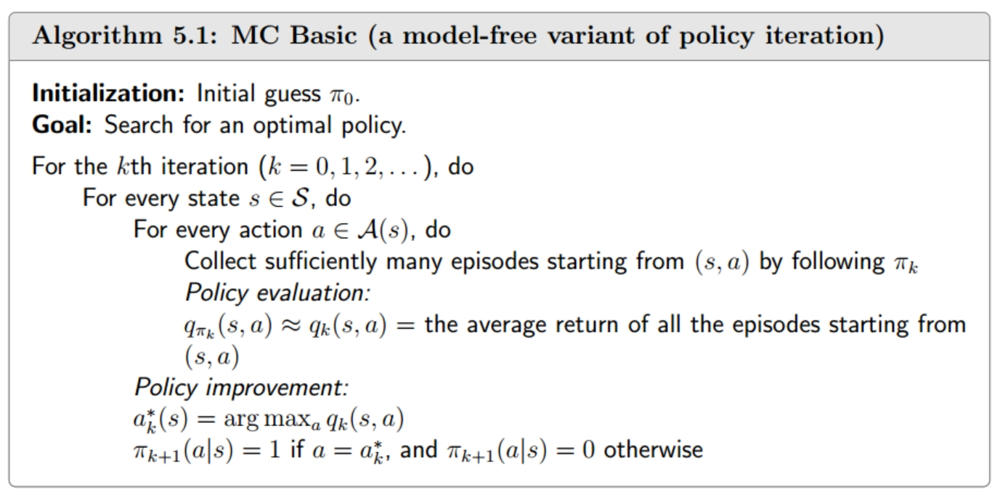

前文介绍的迭代法中使用到了 p(r|s,a)，这是关于环境的信息，包含了完备的状态转移和动作-奖励的概率分布，是基于模型的算法（model-based），但实际问题中，很多时候并不能拿到完备的概率分布，对于这个问题，发展出两种方式，一种是先用环境相关的数据估计状态-动作和奖励间的概率分布，在基于这个模型来迭代策略，一种是 model-free 的算法，model-free 相对更加实用，蒙特卡洛和时间差分是model-free算法中的两种代表性思路。

## 蒙特卡洛算法

蒙特卡洛算法（monte-carlon）算法是将迭代法用于无模型的情况中，value-iteration 和 policy-iteration 核心都是求解 q(s,a)，所以接下来的问题是，如何在 model-free 的情况下估计 q(s,a)？

结合动作值函数的定义和大数定律：

{: width="600" height="500" }

得出用经验数据来估计动作值函数的方式：

- 这里的 g(s,a)是 $G_t(s,a)$ 的一个采样，是在时刻t，从状态 s，采取动作 a 后，运行 episode 结束的一条轨迹的累积回报。
- 根据大数定律，当采样轨迹足够多时，对所有轨迹的累积回报求均值，会接近期望回报。
- 有模型的时候，可以根据模型求解，没有模型的时候，用经验数据来估计期望回报。

MC算法步骤：

{: width="600" height="500" }

- 跟 policy-iteration 相比，区别在于策略评估时，用经验数据来估计动作值函数，而不是基于模型来求解贝尔曼方程中的 v(s)。
- 这个算法是MC的基本算法，因为对于每一个状态-动作对，都需要收集从该状态到结束的轨迹，数据使用效率很低，提高数据使用效率，一个 episode 截断多次使用，重复使用一条轨迹的数据来计算轨迹中所有经过的状态-动作对，为了提高计算和更新的效率，可以在每一条轨迹结束后立即更新，而不用等到所有轨迹收集完毕。

## 时间差分学习

蒙特卡洛方法至少需要等到整个 episode 运行完得到累积回报后，才能更新，早期状态获取反馈有延迟，不同轨迹之间累积回报波动较大，加上多步奖励积累放大了波动，导致价值估计方差很大，收敛速度慢。时序差分（Temporal Differences）方法能够在每个 step 之后使用即时奖励更新估计值，结合了蒙特卡洛无模型和迭代法即时更新的优点，大大提高收敛速度。

TD方法是由 Richard S. Sutton在论文 Learning to Predict by the Methods of Temporal Differences 中提出的，其核心思想与心理学和动物学习中的 Rescorla-Wagner 模型 类似，Rescorla-Wagner模型是指，**实际发生的事情和心理预测的情况差异越大，人和动物越能从这种预测误差中学习**。这跟我们在生活中的体验很接近，预测误差越大，信息量越大，之前认知中可调整的部分越大。

TD 方法的核心便在于如何使用即时奖励来计算预测误差，以及如何用预测误差来更新之前的估计值。

理论上，预测误差由当前估计值 v(s) 和实际的 state-value 来计算，但 state-value 是未知的，且正是需要估计的目标值。所以这里引入即时奖励，用即时奖励和当前价值函数对下一个状态价值的估计 v(s’) 来作为更新目标，进而计算预测误差，然后用自举法来更新当前估计值。数学表示如下：

- 只更新当前时刻 t 访问的状态值。
- 更新方式类似于梯度下降，区别在于梯度下降的更新目标是固定的，而 TD 方法中，更新目标随着价值函数的更新而更新。
- 即时奖励作为信号，引导价值函数朝着更阶级实际奖励的方向更新。

公式中各部分名称：

- 能够从数学上证明，$\bar{v_t}$ 比 $v_t$ 更接近 v_π，当 td-error 逼近零时，$v_t$ 逼近 $v_π$

在数学上，TD算法实际上是在无模型的条件下，求解给定策略的贝尔曼方程：

- TD算法是由 Robbins-Monro algorithm 求解贝尔曼方程推导得出。（RM算法是随机近似算法的一种，随机梯度下降就是RM算法的一种特殊形式。）

### TD(λ)

首先，定义 n-步回报：

- 1-步回报 (TD(0)目标): $G_t^1 = R_{t+1} + γV(S_{t+1})$
- 2-步回报: $G_t^2 = R_{t+1} + γR_{t+2} + γ²V(S_{t+2})$
- n-步回报: $G_t^n = R_{t+1} + γR_{t+2} + ... + γ^{n-1}R_{t+n} + γ^nV(S_{t+n})$
- ∞-步回报 (MC目标): $G_t^∞ = R_{t+1} + γR_{t+2} + γ²R_{t+3} + ...$ (直到终止)
    
λ-回报 $G_t^λ$ 是所有 n-步回报的加权平均，公式为：
$$G_t^λ = (1-λ) ∑_{n=1}^∞ λ^{n-1} G_t^{(n)}$$
- 权重为  $(1-λ)λ^{n-1}$，选择这个权重更多是从工程上考量，便于快速计算。

TD(λ) 更新公式：
$$V_{t+1}(S_t) = V_t(S_t) - α [V_t(S_t) - G_t^λ]$$

#### 资格迹

为了在实际中应用这个 TD(λ) 算法，提出资格迹，解决计算效率和信用分配两个问题。

上面的更新公式，是前向视角，是从一个状态出发，等到整个轨迹结束后，遍历计算从该状态到中间每个状态的回报，对于每个状态，都需要重复这种遍历计算操作，计算量很大。

资格迹采用后向视角来更新，也就是每走一步，就把当前步看做终点，然后向后去找需要更新的状态，但其中就涉及信用分配问题，过去经历的所有状态对当前步获得的回报有不同权重，如何分配这种权重。对应到 td-error, 也就是如何将误差分配到不同状态进行更新？通常有两种思路，一种是状态访问频率越高，对结果起的作用越大，一种是越接近终点，作用越大，资格迹综合频率启发和最近启发这两种思路。形象的来说，相当于每个状态维护一个痕迹（短期记忆），当访问这个状态时，增加资格迹，当没有访问时，就随时间衰减。
资格迹更新公式：

$$
e_t(s) =
\begin{cases}
\gamma \lambda \cdot e_{t-1}(s) + 1, & \text{如果 } s = S_t \text{ (当前状态)} \\
\gamma \lambda \cdot e_{t-1}(s), & \text{如果 } s \neq S_t \text{ (其他状态)}
\end{cases}
$$

- $\gamma$: 折扣因子，取值范围 $[0, 1]$
- $\lambda$: 迹衰减参数，取值范围 $[0, 1]$  
- $S_t$: 时间步 $t$ 的当前状态
- $e_{t-1}(s)$: 上一时间步状态 $s$ 的资格迹

使用资格迹进行价值函数更新：
$$δ_t = R_{t+1} + γV(S_{t+1}) - V(S_t)$$
$$V(s) ← V(s) + α δ_t e_t(s) $$

这种方式，通过资格迹向量，每走一步，就能一次性的对所有历史状态的价值进行更新， 减少计算量的同时，也可以实时在线学习。

## MC vs TD

### 估计误差

在统计学习中，估计值与真实值之间的误差由偏差和方差组成。偏差衡量的是估计值与真实值之间的系统性差异，比如在打靶的过程中，如果所有子弹都稳定地打在同一个点，但这个点偏离了靶心，这就是高偏差。方差衡量的是估计值本身的波动范围，打靶过程中，子弹打得非常分散，到处都是，这就是高方差。

**MC算法是低偏差高方差的**：真实价值函数是在给定策略π下，从状态 s 到终点的所有可能轨迹的期望回报。MC对多条实际运行轨迹的回报求均值来估计真实价值函数，需要完整轨迹才能更新。对随机变量采样进行估计，样本始终围绕真实值波动，不会存在某种结构性或系统性的高估或低估，样本均值是总体期望的无偏估计。所以MC是无偏的，数据充足的情况下，有良好的收敛保证。但由于需要对完整轨迹采样，而环境和策略存在随机性，也就是状态转移概率和状态-动作概率分布，导致每个 step 的奖励是波动的，这种波动会累积到整个轨迹的回报上，导致MC高方差的现象。

**TD算法是高偏差低方差的**：TD算法是朝着 td-target 方向更新，但 td-target 并不是真实价值函数，而是当前估计价值函数对 s’ 的估计， 更新目标本身就是有偏的，所以这里存在一个系统性的偏差，偏差大小取决于当前估计的价值函数。TD算法在每个 step 用即时奖励进行更新，相比整个轨迹的回报，波动更小，方差更低，所以相对MC更加高效。在某些情况下，TD算法的偏差会影响到收敛结果，导致整个算法失效。

### 初始值的影响

MC算法是无偏的，所以哪怕初始估计值跟真实值相差较大，也能通过后续经验样本来调整和纠正。而TD算法是有偏的，偏差取决于当前估计的价值函数，同时TD采用的是自举的更新方式，更新目标依赖于当前的估计值，初始估计值对TD收敛速度影响会更大。

### 马尔可夫性

TD更好的利用的马尔科夫性，进行一步前瞻，根据当前状态和下一状态就能进行估计和更新，不需要知道完整的历史轨迹。所以 TD 算法隐含的假设环境符合马尔可夫性，当环境实际上并不符合马尔可夫性时，TD的效果可能会降低。

MC算法收集完整轨迹的经验数据，忽视了马尔可夫性，对环境也不做假设。当环境的回报不仅仅依赖于当前状态，而且关乎前序一系列状态时，MC算法能够更好的学到序列中的长期依赖关系。

