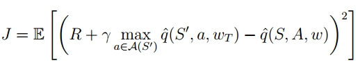

## Sarsa 

时间差分提供了给定策略下，状态价值函数评估的方法，是后续TD算法的基础。由于无模型环境中，并不知道在状态 s 选择动作 a 后转移到不同状态的概率，以及获取奖励的概率，也就无法根据 state-value 来选择动作， 所以估计的状态价值无法直接用于策略提升。需要估计各个状态-动作对的动作价值，拟合动作值函数，然后结合 policy-impovement 方法来进行策略优化。

动作值函数更新公式：

- 之所以叫 sarsa，是因为使用了 (st; at; rt+1; st+1; at+1)
- 可以从 RM 算法求解动作值形式的贝尔曼方程中推导得出，也能够从状态值函数的TD算法中推导。

估计出给定策略的动作值之后，结合贪心算法或 epislon-greedy 算法来选择动作，进行策略提升，就是完整的策略优化算法。算法流程：

- epislon-greedy 算法，对最大动作值对应的动作赋予较大概率，其余动作赋予较小概率（增加探索性）

#### 收敛性

在状态-动作对被无限访问，和贪心策略的条件下，sarsa 理论上可以收敛到最优策略，但实际情况只能接近最优解。收敛性依赖于策略探索能力，如果state-action pair 访问次数不足，会导致动作值评估不准，策略陷入局部次优解。

### N-step Sarsa

使用 n-step return，更新公式为：

### Sarsa(λ)

和 TD(λ) 思路一致，q^λ 为 n-step 动作值的加权平均：

后向视角结合资格迹的更新公式：

完整算法：

> **on-policy vs off-policy** 
> 
> 行为策略（behavior policy）：生成经验数据的策略 
> 
> 目标策略（target policy）：算法优化的策略 
> on-policy：行为策略和目标策略是同一个策略。
> - sarsa 和 mc 都是用策略生成的样本数据评估动作值，进而更新策略，然后用更新后的策略继续生成数据，所以是 on-policy 的。 
> 
> off-plicy：行为策略和目标策略不同，能够从其他策略中学习，增加对状态动作对的探索和覆盖。
{: .prompt-info }

## Q-learning

sarsa 是 on-policy 的，很难直接使用离线数据来进行训练，哪怕产生离线数据的策略和目标策略初始时一直，但由于目标策略不断更新，也会导致行为策略和目标策略不一致，虽然也能使用重要性采样这样的技术来调整。但 q-learning 提供了一种能直接使用离线数据训练的方法。

q-learning 更新公式：

- 是在求解贝尔曼最优公式
    
    
    

行为策略产生数据 (s_t,a_t, r_{t+1}, s_{t+1}) ，但目标策略对应的是 max q_t(s_{t+1})，选择的动作不是行为策略对应的 a_{t+1}，而是maxQ 对应的动作，所以是 off-policy 的，能利用不同策略产生的离线数据来训练。

通过 maxQ 引入 td-target，q-learning 朝向最优价值函数进行更新，直接学习最优策略。

直观的理解，sarsa 是自己的行为和环境反馈来优化，是更加务实的，能考虑更多探索过程中的实际风险。q-learning 更新公式中的 maxQ 就好像一份标准答案，q-learning 对照经验数据和标准答案的差异，直接朝向最优策略学习，是更加理想化的。

比如在悬崖路径的例子，q-learning 会学到靠近悬崖边的最短路径，但实际运行过程中，有摔下悬崖的风险。而 sarsa，在训练过程中，能够从策略本身摔下悬崖的经验中学习，从而估计的靠近悬崖的状态价值较低，得到远离悬崖，更加安全的策略。

历史上， q-learning 是先于 sarsa 提出，直接学习最优策略，但实际运用中，发现在高风险的环境中，学到的策略实际执行时可能导致危险。所以提出了 sarsa 算法，根据在策略下实际产生的轨迹来评估动作值，根据估计的动作值来提升策略。

完整算法：

- 由于行为策略负责产生数据，目标策略不用考虑探索性，使用贪心算法更新。

## Sarsa vs  Q-learning

1. td-targe 不同
    1. sarsa 评估的是当前策略的动作价值，而 q-learning 将最优策略的动作值作为更新向导，不考虑实际执行的动作，直接学习最优策略。
    2. sarsa 价值估计中考虑到了动作探索带来的实际反馈，在有风险的环境中，会趋向于保守安全的策略。
    3. q-learning 使用理论最优策略来估计动作价值，忽略实际执行动作带来的风险，会倾向于选择高风险的理论回报最大的策略。
2. on-policy 与 off-policy 的区别
    1. sarsa 是 on-policy 的，收敛效果依赖于策略本身的探索能力，探索有限的情况下，会收敛到局部次优策略。数据无法重复使用。
    2. q-learning 是 off-policy 的，能够从其他策略的离线数据中学习，支持数据回放。
3. 稳定性
    1. sarsa 学习目标（Q(S',A')）在训练过程中不断变化，导致不稳定。
    2. q-learning 学习目标相对稳定，在 max 操作也可能导致Q值过高估计和训练不稳定。

### A unified viewpoint 

## value function approximation

之前的方法，需要将 π(s), q(s,a) 存储下来，通常是以表格的形式，当状态动作空间较大时，存储和检索压力都会增加，不利于训练，且当状态动作空间是连续的时候，表格形式无法直接处理。所以使用函数拟合方法，用模型去拟合策略和动作值函数。这里的模型可以是机器学习的各种模型，比如线性模型、决策树、神经网络等，但强化学习中，常用的是深度模型，神经网络能处理高维输入（如像素数据）并提取特征。

函数拟合状态值函数，loss 函数：

梯度下降求解：

权重更新公式：

随机梯度下降：

结合TD算法：

动作值估计（Sarsa Sarsa with function approximation ）

最优动作值估计 Q-learning with function approximation：

算法过程：

- 通过求梯度，更新动作值函数权重，更新 q(s,a,w)
- 使用更新后的动作值函数来选择动作，更新策略。

算法本质上没有改变，只是将之前记录动作值函数和策略的表格，在技术上更换为使用模型（神经网络）来替代。之前根据（s，r，a）来更新表格时，是检索到具体的状态动作对来更新，使用网络拟合时，是根据（s，r，a）来求梯度并更新网络参数，这种方式相比表格更新，更具有泛化性，数据效率更高。

## DQN

在Q-learning with function approximation 的基础上使用两项技术：

### 目标网络延迟更新

目标函数（loss 函数）：

- q-learning 中使用一个网络拟合动作值函数，公式中两部分Q函数，使用一个网络拟合，使用同样的参数，同时更新，这样更新的目标本身就在不断变化，会导致训练不稳定。
- DQN 中将公式中的动作值函数Q值，看做两个网络，使用不同参数，r + q^(s’, a, w_t) 是更新目标，相当于 y 值，看做固定值。
- 数学上，可以理解为将 w_t 看做固定值，仅对 w 求导

- 主网络每次迭代更新，用于选择动作，目标网络定期从主网络拷贝参数，定期延迟更新，用于计算损失。
- 两个网络互相关联：目标网络的参数来源于主网络，主网络的更新依赖于目标网络生成的 y 值，计算损失。
- 目标值相对固定，主网络训练更加稳定。

### Experience Replay

由于没有先验知识，并不知道那些状态是更重要的，所以训练时需要对所有数据一视同仁，需要均匀采样。训练数据独立同分布假设也是神经网络泛化性的基础，而强化学习本身的数据是序列相关的，如果直接用来训练网络，几个批次的数据都很相似，会导致梯度方向出现偏差，过度拟合最近的数据，而忘记之前学到的模式，使得参数更新震荡，总是在“追赶”最新的局部数据模式，无法学到一种全局一致、稳定的Q值函数，，导致训练极其不稳定甚至发散。

所以需要使用经验回放技术，将数据（s，a，r，s’）存储后，随机采样，打破数据间的相关性，这样一次采样的数据包括不同区域不同时间的样本，提高训练的稳定性和收敛性。同时经验回放允许数据被重复使用，提高数据利用效率。

数学上来理解，DQN的目标函数中包含了期望，就涉及到了（s，a）的分布，如果数据只分布到局部序列上，期望是不准确的。而 q-learning 等基于表格的方法求解的是贝尔曼最优公式，通过RM算法推导出的迭代法来求解，并不涉及到数据分布，也就不要求数据接近均匀分布了。
