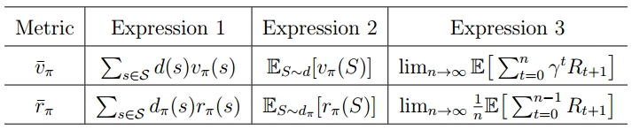
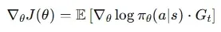
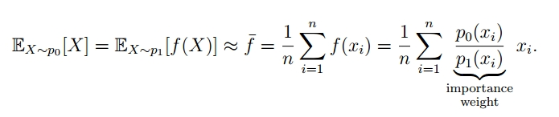
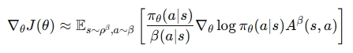

## 策略梯度原理

前面的方法都是基于贝尔曼方程，贝尔曼方程定义了状态及动作价值，前述算法通过经验数据来估计动作值，或者通过RM算法来求解贝尔曼最优方程，进而发展出时间差分的算法，然后在此基础上，引入神经网络，经验回放的技术，来解决规模更大更复杂的问题。这些方法的本质是通过状态动作值估计和优化，间接的优化策略，进而逼近最优策略。这些方法称作 value-based。

value-based 方法算动作值时需要枚举动作，只适用于离散动作和确定性策略。确定性策略输出具体的动作，而随机策略输出动作的概率分布。

当 state value 发生重叠，也就是不同的 state 由于编码后计算得到相同的价值时，用value-based方法就无法得到最优策略，当只有部分观测，无法满足 markov 性时，或者用的 value approximation function 没有很好的近似真实value， 确定性策略不一定是最优的，随机策略会表现得更好。这时候需要 PG 方法来优化随机策略。

#### 确定性策略 vs 随机策略

- value based 方法主要用于离散动作的确定性策略问题
- 下表是在策略梯度方法范畴内对比

| **特性**             | **确定性策略梯度**                       | **随机策略梯度**                                      |
| ------------------ | --------------------------------- | ----------------------------------------------- |
| **输出**             | 具体的动作 a                           | 动作的概率分布 π(a,s)                                  |
| **策略表示**           | 函数 μ(s)                           | 概率分布π(a,s)                                      |
| **动作采样**           | 直接由策略网络输出                         | 通过概率分布采样                                        |
| **探索性**            | 弱，需要外部机制（如噪声）                     | 强，策略本身自带探索性                                     |
| **可控性**            | 随机性大小可通过噪声参数精细调节探索强度              | 不易控制                                            |
| **方差特征**           | 方差低（确定输出）                         | 方差大（因为随机性来自采样）                                  |
| **偏差**             | 可能有偏（依赖 critic 的近似）               | 无偏估计                                            |
| **是否可 off-policy** | 可天然 off-policy（如 DDPG, TD3）       | 一般为 on-policy（如 REINFORCE, PPO），重要性采样后为 off-policy |
| **采样效率**           | 高（off-policy）                     | 较低（on-policy）                                   |
| **实现复杂度**          | 需额外 critic + 噪声控制                 | 相对简单                                            |
| **适用动作类型**         | 连续                                | 离散 & 连续（概率分布或概率密度分布）                            |
| **适应算法**           | DPG、DDPG、TD3、Deterministic SAC    | REINFORCE（离散）、A2C（离散）、PPO（离散连续都可）               |
| **适用场景**           | 稳定环境、评价阶段、连续控制; 比如自动驾驶为了安全性输出确定动作 | 需要探索的环境、部分可观测环境、对抗环境                            |

为了能够直接学习策略和应对随机策略问题，发展出 policy-based 方法，1983年，Williams, Ronald J. 发表论文推导出策略梯度公式，提出REINFORCE算法。

policy-based方法绕开状态动作价值，通过迭代策略参数，直接优化策略，其核心思想是将策略参数化并优化策略本身，通过调整策略参数，来提高带来高回报动作的概率。策略梯度的方法首先定义最优策略的目标函数，然后用基于梯度的优化算法来更新参数。将策略参数化，避免了对状态动作对应概率分布的存储和检索，能够提高效率和泛化性。

接下来的问题便是，如何定义目标函数，如何进行梯度优化，收敛性是否有保障。

### 目标函数：

表格形式下，最优策略定义为，对所有状态 s，v*(s) >= v_π(s)。而参数化下的最优策略定义是能够最大化目标函数的策略，目标函数有以下两种等价的定义。

**1. 平均状态值**

- d(s) 表示策略π 下，状态 s 的概率分布。

**2. 平均奖励值**

**在 γ < 1 时，两个形式是等价的**：（证明过程参见《强化学习数学原理》）

总结

### 梯度

### 梯度推导过程

1. **基于轨迹定义期望回报**

2. **梯度求导**

> 梯度为什么要变换为 log ？
> - 稳定更新
> - 将很小的数值缩放成负数，便于计算
>- 链式发展，能将乘变为加
{: .prompt-info }

3. **对数项展开**

4. **策略梯度公式**

上述公式是轨迹维度上的梯度和，表示一条轨迹整体的梯度期望，等于每个时间步 t 的梯度期望之和，实际中，并不会等到轨迹完成才更新，而是拆分到每个时间步进行梯度更新，同时用随机梯度方法使用单样本来近似期望。

5. **将 G_t 替换为 Q_t：**

- G_t 是真实回报的采样，是无偏但高方差的，用蒙特卡洛算法来估计，就是 REINFORCE 算法。
- Q_t 是通常会用函数逼近器来近似真实的 Q^π，是有偏但低方差的，这个函数逼近器被称作critic，用于 actor-critic 算法。
- 这里的对数梯度，并不是对策略网络输出的整个分布求梯度，而是对在当前样本中所选动作的对数概率求梯度，是一个标量。$log_π(a|s)$ 的梯度意味着当前选中动作本身的概率梯度，表示如何调整参数能够增大或减小动作概率。而Q_π(s,a) 表示当前动作在当前状态下的期望回报。两者结合，使高回报的动作往增加概率的方向调整参数。
- 在求梯度的过程中，需要从当前状态对应的动作分布中，对动作进行采样来估计期望梯度，这个操作增加了梯度的方差。
- 梯度公式中，需要对当前状态对应的动作概率分布求梯度，这个分布和目标策略分布需要一致，也就是行为策略和目标策略一致，是 on-policy 的，数据使用效率相对更低。调整为 off-policy，需要使用重要性采样技术，在高维空间中会更加波动。

**为了更直观的理解，将策略更新部分变换为：**

- 梯度增加和降低的幅度取决于动作值和当前选择 (s,a) 的概率，动作值越高，越倾向于选择 (s,a)，这是利用。当前选择 (s,a) 的概率越低，越倾向于选择 (s,a)，这是探索。通过这种方式来平衡利用和探索。

> PG vs DL 
> 
> 策略梯度算法过程和深度学习的范式很相似，定义目标函数，通过梯度和反向传播更新参数，最大化目标函数。
> 
> 策略梯度方法和深度学习的区别在于：
> - 目标函数不是静态的标签，而是需要通过试错来估计的回报。
> - 数据分布不是固定的，而是随着正在优化的模型本身而不断漂移。
> - 反馈信号不是直接、密集的，而是延迟、稀疏且充满噪声的。

| **维度**       | **监督学习**                                       | **强化学习**（PG)                                                 |
| ------------ | ---------------------------------------------- | ------------------------------------------------------------ |
| **问题框架与目标**  | **模式识别**：从数据中寻找静态的映射关系。给定输入x，预测标签y。            | **序列决策**：在动态环境中通过试错学习如何行动以最大化长期收益。                           |
| **目标函数的性质**  | **定义清晰、静态、可直接计算**（如交叉熵损失、均方误差）。我们知道每一个x对应的真实y。 | **定义模糊、动态、需要通过交互估计**（如期望回报J(θ)）。我们不知道什么是最优动作，只知道当前动作的好坏评价信号。 |
| **数据生成机制**   | **独立同分布**：数据通常一次性给定，且与模型当前状态无关。                | **非平稳、自举**：数据由当前策略与环境交互实时产生。策略一变，数据分布就变。                     |
| **反馈信号**     | **直接、密集、无歧义**：每个样本都有对应的真实标签作为监督信号。             | **延迟、稀疏、带有噪声**：只有最终的成功/失败或偶尔的奖励，且一个奖励可能由之前很长一串动作共同导致。        |
| **探索与利用的困境** | **不存在**。数据是给定的，只需拟合。                           | **核心挑战**。必须在探索未知领域（可能发现更高回报）和利用现有知识（获取稳定回报）之间做权衡。            |

## MC估计期望回报| REINFORCE 

如前所述，用蒙特卡洛算法来估计梯度中的期望回报，便得出REINFORCE算法：

- 根据梯度公式，REINFORCE  更新的策略同时也是产生数据的策略，是 on-policy 的，同时策略本身是随机的，自带探索性。每次更新策略使用的都是当前策略产生的数据，每个 episode 的数据只会使用一次，所以数据使用效率更低。
- 解决策略梯度算法数据效率问题，也延伸出很多新的思路和方法，比如引入基准（REINFORCE with baseline，A3C），重要性采样（off-policy），使用更高效的梯度估计方法（TRPO），跟值函数方法的结合（AC、DDPG）等算法上的改进，以及工程上使用并行训练（A3C）、自适应学习率等方法。
- 同时 on-policy 策略，采样数据是策略本身产生的，所以策略的探索机制就非常重要了，研究者们也提出很多方法来确保探索的充分性，比如引入熵正则化、Boltzmann 探索、好奇心驱动的探索、探索-利用的平衡策略等等，这个方向也是强化学习前沿研究中重要而热点的方向。
- 蒙特卡洛方法，是 offline 的，需要等运行完整个 episode 才能计算 return 进行更新，每个 episode 之间差异可能较大，导致梯度更新时的高方差。为了解决高方差，研究者们也提出一系列新的方法，包括基线方法，广义优势估计（通过平衡偏差和方差，减少梯度估计的方差），重要性采样，延迟更新，自然梯度方法，小批量更新等。
- 局部最优解（近似最优）
	1. 当动作状态空间很大的时候，智能体跟环境的交互是无法遍历所有动作状态的，训练时间成本有限，所以只能在探索到的有限的数据中，取得最优策略。
	2. 梯度上升的方法本身的局限性，在复杂高维空间，很可能会陷入局部最优解。
	3. 近似最优：算法无法取得全局最优，只是在已知数据下，取得尽可能好的解。获得一个足够可用的策略，然后不断优化，只能接近最优，无法完全达到最优。

总结来说，最初的策略梯度算法，由于使用蒙特卡洛来估计期望回报，出现和蒙特卡洛算法相同的问题，也就是样本使用效率低和高方差，为了解决这两个问题，衍生出一系列策略梯度算法。

## Policy-based vs Value-based

**优化目标相同**
- 找到能最大化期望回报的策略，理论上两者的最优策略是一致的。
- 假设在适用于两种算法的相同的环境下，理论上能够收敛到同一个最优策略。但实际上，由于优化路径不同，误差来源不同，优化表面不同，收敛点可能不同。比如在复杂函数逼近器（神经网络）下，两种训练信号会落入不同的局部最优。

**不同点**

| 方面 | Value-based | Policy-based |
| --- | --- | --- |
| **核心目标** | 学习状态或状态-动作的“价值函数” V(s)或 Q(s,a) | 直接学习最优策略 (\pi_\theta(a |
| **策略获取方式** | 通过 Q(s,a) 间接得到策略（如选取最大 Q 值的动作） | 直接参数化策略（输出概率分布） |
| **更新依据** | Bellman 方程（时序差分 TD） | 策略梯度（Policy Gradient）或其变体 |
| **收敛稳定性** | 有时震荡（max 操作不光滑） | 通常较稳定（梯度上升） |
| **方差** | 方差较低（TD 学习） | 方差较高（采样估计） |
| **偏差** | 存在偏差（bootstrap 引入，目标包含自己预测的值） | 无偏估计（REINFORCE） |
| **探索性** | ε-greedy 等手工加噪声 | 策略本身输出概率分布，天然具探索性 |
| **适用动作空间** | 适用于离散动作 | 适用于连续或高维动作 |
| **样本效率** | 较高（可重用旧数据，off-policy） | 较低（多为 on-policy） |
| **实现难度** | 较易（如 DQN） | 相对复杂（如 PPO、A3C） |
| **代表算法** | Q-learning, DQN, DDQN | REINFORCE, A2C/A3C, PPO, TRPO, DDPG, SAC |

## TD估计期望回报| Actor-Critic

策略梯度方法的问题在于方差较高，如果用TD方法来估计期望回报，即能够直接优化策略，又降低了方差。

使用TD方法估计期望回报的策略梯度算法，被称为 actor-critic，其中输出动作的策略，叫做 actor，critic 负责估计当前策略的状态值或动作值。

- 这里的 critic 是 sarsa 算法结合 value function approximation，critic网络，输入状态和动作，输出动作值。
- critic 网络目标函数是真实状态值与当前状态值的均方误差，用时间差分方法中的 td-target 来估计真实状态值，然后求梯度得出更新公式。

## A2C | Baseline

A2C 是由 A3C (Asynchronous Advantage Actor-Critic) 简化而来，由于策略梯度方法存在高方差、并行能力差训练慢的问题，DeepMind 在2016年提出异步的AC算法，在AC的基础上，使用优势函数，结合异步多线程的技术。但发布后，存在异步更新不可复现、实现复杂调试困难、不同线程更新全局参数会引入梯度竞争的问题，所以在 A3C 的版本上，简化提出同步版本 A2C，保留优势函数，多线程同时运行，完成后统一更新梯度。所以A2C的核心在于优势函数。

**策略梯度中引入基线**

无偏性|引入基线后不会改变梯度期望

**最优基线**

引入基线不会改变梯度期望，但对方差会有影响，最小化方差推导出最优基线。

由于期望偏差是固定的，最小化方差等价于最小化二阶矩**：**

得出最优基线：

最优基线是 Q(s,a) 的加权平均，为了便于计算，实际使用中去掉权重：

**优势函数**

- 从直觉上理解，v_π(s) 是状态 s 的期望回报，Q_π(s,a) 是在状态 s，选择动作 a 的期望回报，二者相减，表示选择动作 a 相对于期望回报的差值。
- 相对值更能反应动作间效果的对比，比如有的状态值本身就很高，这些状态对应的动作值也更高，梯度也会增加，更新更加陡峭。相对值更能反应动作在当前状态基础上的效用。
- 通过减去期望回报来减少随机波动，从而降低梯度估计的方差。
- 很妙的是，去掉权重后的基线正好是 state value，优势函数也正好是 td error（所以只需要一个状态值网络来做为 critic）：
    
    
    

**算法过程**

- critic 拟合的是状态值函数，critic 网络目标函数是真实状态值与当前状态值的均方误差，用时间差分方法中的 td-target 来估计真实状态值，td-target 与当前状态值的差值即为 td-error。梯度更新公式推导参见《强化学习基础三》中 value function approximation 部分。
- critic 通过减小 td-error，提供更准确的基线，进而减小方差，稳定训练。

## off-policy | 重要性采样

策略梯度算法天然是 on-policy 的，因为梯度更新中的策略参数，也是产生数据的策略。为了更充分的利用数据，使用重要性采样技术，将策略梯度算法转换为 off-policy 的。

策略梯度目标函数是状态值或奖励的期望，不同策略，期望也不同，求梯度时估计的是需要更新的目标策略的期望值，用其他策略产生的样本来估计，会有偏差。所以问题就在于如何纠正这个偏差，如何用行为策略的样本，去估计目标策略的期望。抽象出来，就是用一个分布的样本，去估计另一个分布的期望。而这正好能用重要性采样来解决。

**重要性采样**

- 通过 p_1 的样本，来估计 p_0 的期望
- 对 x_i，当 p_0(x_i) > p_1(x_i) 时， p_0(x_i)/p_1(x_i)  > 1，增加权重；反之，减小权重。通过加权，调整采集到的样本点的概率计算，进而使其更解决目标分布的期望。

**应用到梯度更新公式中**

- β 是行为策略，ρ 是目标策略
- 增加重要性权重，用行为策略的样本来估计目标策略的期望

**对应到AC算法**：

- actor 和 critic 的权重更新中都需要加上重要性权重
- 重要性权重在高维连续空间中波动剧烈，方差极大，实际使用中需要考虑这一点。

## DPG

前述介绍的算法针对的都是随机策略，也就是策略π 输出的是一个关于候选动作的概率分布，当动作是连续的，动作空间无限大时，随机策略建模的是动作概率密度分布，建模困难，且样本效率低，在高维连续动作空间中积分（或采样）计算代价高。进而发展出确定性策略梯度方法，在**连续动作空间**中，输出一个确定的动作，不仅能够精确控制信号，适用于自动驾驶、机器人控制等需要精确控制的问题，同时还能降低方差，且天然适用于off-policy，进而提高样本效率。

2014年，《*Deterministic Policy Gradient Algorithms*》论文发表，证明确定性策略梯度存在，可以通过对动作值函数求梯度来计算，提出了DPG的算法理论框架，论文中假设能够访问动作值函数并能够对其求梯度。2015年提出的DDPG是DPG的工程实现，用神经网络来估计动作值函数，解决梯度计算问题。

**梯度公式**

- 在 DPG 的理论推导中，Q 是真实的动作值函数，假设可以访问其梯度。
- 在 DDPG 的实现版本中，Q 是神经网络，是关于 a 的可微函数。
- 离散动作空间无法求导，所以DPG只能用于连续动作。
- 降低方差：对比随机策略梯度（SPG），当前状态下，输出的动作是确定的，不需要像SPG那样从动作分布中随机采样，唯一的随机来源是状态采样，所以相比SPG，降低了方差，增加收敛速度。
- 天然支持off-policy：由于不需要从动作分布中采样，所以并不要求更新的目标策略和行为策略分布一致，可以从任何其他行为策略产生的数据中学习。进一步提高了样本效率。

直观的理解，随机策略梯度基于采样的动作的好坏来调整动作采样概率，确定性策略梯度像"梯度上升"，直接计算哪个方向的动作能获得更高的Q值，然后朝那个方向调整策略。

**算法流程**

- 这里 critic 和 DQN 中 Q网络更新类似，但二者作用不同，dpg 中的 Q网络用于指导 actor 动作更新的梯度方向。

## DDPG

DDPG 是 DPG 的工程实现版本，用神经网络来拟合动作值函数，通过反向传播求梯度，用于更新 actor 和 critic，由 DeepMind 在 2015 年提出（Lillicrap et al., *Continuous control with deep reinforcement learning*）。critic 以自举的形式来更新，存在不稳定的问题，加上 DPG 天然适用于 off-policy，从这两点出发，正好借鉴 DQN 中目标网络延迟更新和经验回放技术，稳定训练的同时，提高样本使用效率。所以 DDPG 可以看做在 DPG 和 DQN 的结合。

针对确定性策略， 使用 Ornstein–Uhlenbeck (OU) 噪声（模拟平滑的时间相关噪声）或高斯噪声来增加策略的探索性。

- 目标网络（用于计算 critic 的td-target y 值）使用软更新技术来提高稳定性，包括 actor 和 critic。
- 在应用过程中，发现 DDPG 的一些问题，比如对超参数敏感，Q值容易过估计，训练不稳定的问题，在这些问题基础上，衍生出一系列改进算法，比如 TD3、SAC。
