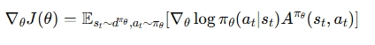
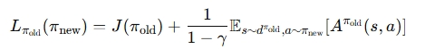
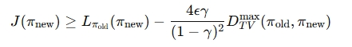
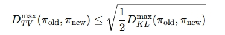
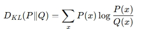
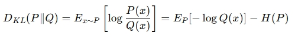
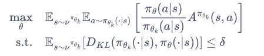
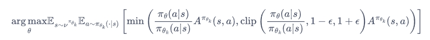
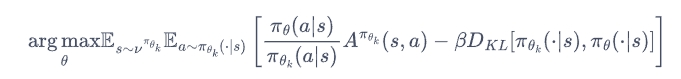

## TRPO

策略梯度公式为：

可以看到，这里是对当前策略求期望，理论上要求每采集一批数据，更新之后，使用新策略跟环境交互，重新采集数据进行更新。但实践中，出于效率和成本考量，通常一个版本策略跑一段时间数据后，才进行采样，在这批数据上进行多次梯度更新。这样采样数据和数据下不断更新的策略有差异。导致分布偏移，数据和目标策略不一致，引入重要性采样只能修正动作分布差异，不能修正状态分布带来的差异，如果新旧策略差异太大，方差增加，训练极不稳定，且会出现更新过程效果断崖式下降的问题。

TRPO（trust region policy optimization） 的设计就是为了解决这个问题，在旧策略的采样数据上优化（保持采样效率），约束新策略不要离旧策略太远（保持分布一致性），这样就能在有限数据上更新多次，且保持性能稳定。

trpo的核心思想是，在约束策略参数更新范围的同时，在这个更新范围内找到最大化目标函数的解，保证更新稳定性和策略逐步提升 。核心问题是如何求解策略，使得新策略相比旧策略，是单调递增的；以及如何划定参数更新范围，保证更新步长不会太大以至于使策略断崖式下滑。

### 优化目标|策略性能单调递增

**目标函数：**

- 从新策略上进行采样（状态出现的频次）
- 在旧策略上评估（状态的价值），便于对比新旧策略的性能。
- 在旧策略的价值函数上对新策略下状态分布求期望
- 这样新旧策略的分布就一致了，一致的情况下才能相减。分布不一致，就不能用同一批样本无偏的估计差。
- E_s0：对初始状态 s0 的期望，考虑所有可能的**起始情况**，平均来说这个策略表现如何

推导过程： 

**新旧策略性能对比**

- 该公式为 Performance Difference Lemma（性能差引理）（来自 Kakade & Langford, 2002）

**保证策略性能单调递增：**

### 误差分析|性能改进下界

#### 分布替换近似

- 这里将新策略的状态分布替换为旧策略的状态分布
- 同时在目标函数第一步推导过程中，忽略了新旧策略动作分布的差异
- 这是两个主要的误差来源

#### 动作分布误差纠正|重要性权重

- 只修正了动作分布的差异，但没有修正状态分布的差异。
- 实践中，状态高维且转移概率未知，几乎不可能对状态分布做修正

#### 状态分布误差

状态分布差异可能很大，导致误差很大，于是 Schulman 等人（2015, TRPO 论文）分析了这个误差，并推导出一个理论下界，保证只要策略变化不大，就能得到性能提升的下界。

下界：

- 用旧策略数据的状态分布近似新策略状态分布之后的性能差，和真实的性能差异之间的误差
- 量化这个误差，并且证明在某些条件下这个误差是可控的，就能通过优化这个式子来间接地保证真实性能的提升。

#### 性能改进下界|Policy Improvement Bound

- 不等式右边 第一项 L 是可计算的近似性能，第二项是误差上界项，取决于新旧策略的差距
- DTVmax是最大总变差距离（Total Variation Distance）

误差主要来源是新旧策略的差距，那么就需要约束这个差距，这是TRPO的关键思想。

为了计算便利性，用 KL 散度近似总变差距离：

- 通过约束新旧策略KL散度，使新旧策略足够接近，保证估计的新旧策略性能差和真实性能差异之间的误差足够小，进而保证优化估计的性能差，能够使得新策略相对旧策略是单调递增的。
- KL 散度越小，惩罚项越小，近似目标越接近真实目标，新策略性能提升。

优化问题变为：

- 不等式约束定义了策略空间中的一个区域，被称为信任区域。
- 在这个参数更新区域中，更新后的策略和用于数据采样的策略是近似一致的，因而可以在这批数据上进行多次梯度更新。

> **KL 散度** 
> KL 散度（也称为相对熵）用来衡量两个概率分布之间的“差异”：
> 
> 
> 
> KL 散度可以看作真实分布 P 下的期望信息差：
> 
> 
> - 其中H(P)是熵
> - 表示用 Q 来代替 P 时，平均编码长度会多出多少。
{: .prompt-info }

### 求解（略）

求解，用泰勒展开，结合**卡罗需-库恩-塔克**（Karush-Kuhn-Tucker，KKT）条件得出解。

性能提升：

- 近似求解（泰勒展开）
- 共轭梯度法：求解 Fisher 信息矩阵逆，降低计算和存储
- 线性搜索

## PPO

PPO是基于TRPO的简化版本，简化求解过程的计算量，提高训练效率，同时也能保证效果相同，甚至更好。

PPO学习目标和TRPO相同：

PPO 没有显示约束目标函数，而是通过修改目标函数，隐式控制优化过程的更新步伐。有增加惩罚项和截断两个版本。

### PPO-Clip| Clipped Surrogate Objective

目标函数：

- 把比率权重限定在（1-epislon，1+epislon）之间
- 如果A>0，说明这个动作的价值高于平均，最大化这个式子会增大比率，但不会让其超过（1+epislon）。反之，如果A<0，最大化这个式子会减小比率，但不会让其超过（1-epislon）。

### PPO-Penalty| KL Penalty

目标函数：

- 通过拉格朗日乘数法将约束放到目标函数
- 通过更新 β 来调整惩罚项的大小，进而控制参数更新程度。
